# Architecture Documentation

## Overview

The cf-scalable-web infrastructure is designed for high-availability, security, and scalability. It uses a multi-tier architecture with defense-in-depth security principles.

## Network Architecture

### VPC Layout

The VPC uses a 4-tier private subnet architecture plus a public subnet tier:

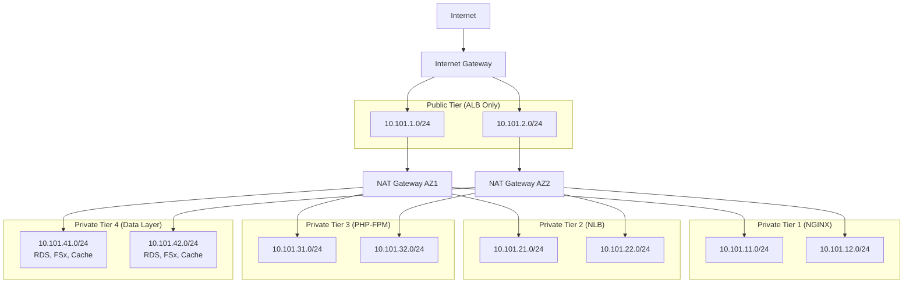
```mermaid
graph TB
    Internet[Internet]
    IGW[Internet Gateway]
    NAT1[NAT Gateway AZ1]
    NAT2[NAT Gateway AZ2]

    subgraph "Public Tier (ALB Only)"
        PublicSubnet1[10.101.1.0/24]
        PublicSubnet2[10.101.2.0/24]
    end

    subgraph "Private Tier 1 (NGINX)"
        NginxSubnet1[10.101.11.0/24]
        NginxSubnet2[10.101.12.0/24]
    end

    subgraph "Private Tier 2 (NLB)"
        NLBSubnet1[10.101.21.0/24]
        NLBSubnet2[10.101.22.0/24]
    end

    subgraph "Private Tier 3 (PHP-FPM)"
        PHPSubnet1[10.101.31.0/24]
        PHPSubnet2[10.101.32.0/24]
    end

    subgraph "Private Tier 4 (Data Layer)"
        DataSubnet1[10.101.41.0/24<br/>RDS, FSx, Cache]
        DataSubnet2[10.101.42.0/24<br/>RDS, FSx, Cache]
    end

    Internet --> IGW
    IGW --> PublicSubnet1
    IGW --> PublicSubnet2
    PublicSubnet1 --> NAT1
    PublicSubnet2 --> NAT2
    NAT1 --> NginxSubnet1
    NAT2 --> NginxSubnet2
    NAT1 --> NLBSubnet1
    NAT2 --> NLBSubnet2
    NAT1 --> PHPSubnet1
    NAT2 --> PHPSubnet2
    NAT1 --> DataSubnet1
    NAT2 --> DataSubnet2
```

**Key Points:**
- Only public IPs on ALB
- Each tier isolated by security groups
- NAT Gateways provide outbound internet (for OS updates, package installs, etc.)
- Multi-AZ deployment across 2 availability zones

### Security Group Architecture

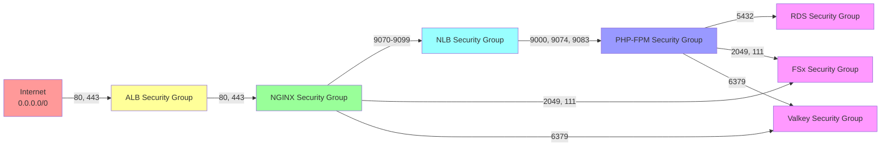
```mermaid
graph LR
    Internet[Internet<br/>0.0.0.0/0] -->|80, 443| ALB[ALB Security Group]
    ALB -->|80, 443| NGINX[NGINX Security Group]
    NGINX -->|9070-9099| NLB[NLB Security Group]
    NLB -->|9000, 9074, 9083| PHP[PHP-FPM Security Group]
    PHP -->|5432| RDS[RDS Security Group]
    NGINX -->|2049, 111| FSx[FSx Security Group]
    PHP -->|2049, 111| FSx
    NGINX -->|6379| Valkey[Valkey Security Group]
    PHP -->|6379| Valkey

    style Internet fill:#f99
    style ALB fill:#ff9
    style NGINX fill:#9f9
    style NLB fill:#9ff
    style PHP fill:#99f
    style RDS fill:#f9f
    style FSx fill:#f9f
    style Valkey fill:#f9f
```

**Security Principles:**
- **No lateral movement:** Each tier can only communicate with adjacent tiers
- **Least privilege:** Only required ports open
- **Defense in depth:** Multiple layers of security

### VPC Endpoints

Private instances reach AWS APIs through VPC endpoints, eliminating the need for NAT Gateway traffic for AWS service calls. These are defined in `cf-vpc.yaml`.

| Endpoint | Service | Type | Notes |
|----------|---------|------|-------|
| SSM | `com.amazonaws.REGION.ssm` | Interface | PrivateDnsEnabled; used by boot scripts for parameter discovery |
| SSM Messages | `com.amazonaws.REGION.ssmmessages` | Interface | Session Manager shell access to private instances |
| EC2 Messages | `com.amazonaws.REGION.ec2messages` | Interface | SSM agent registration |
| Secrets Manager | `com.amazonaws.REGION.secretsmanager` | Interface | Retrieve DB passwords, SSH keys, API tokens |
| S3 | `com.amazonaws.REGION.s3` | Gateway | Free; route-table based; package installs, Image Builder, media |
| SES SMTP | `com.amazonaws.REGION.email-smtp` | Interface | Email sending from PHP instances; single-AZ only |

Interface endpoints are placed in the PHP-FPM subnet tier (PrivateTier3) and secured by a shared `AWSServicesEndpointSecurityGroup` that permits HTTPS (443) from the NGINX and PHP security groups. The SES endpoint has its own security group allowing SMTP (587) and SMTPS (465) from PHP only.

## Request Flow

### HTTP/HTTPS Request Flow

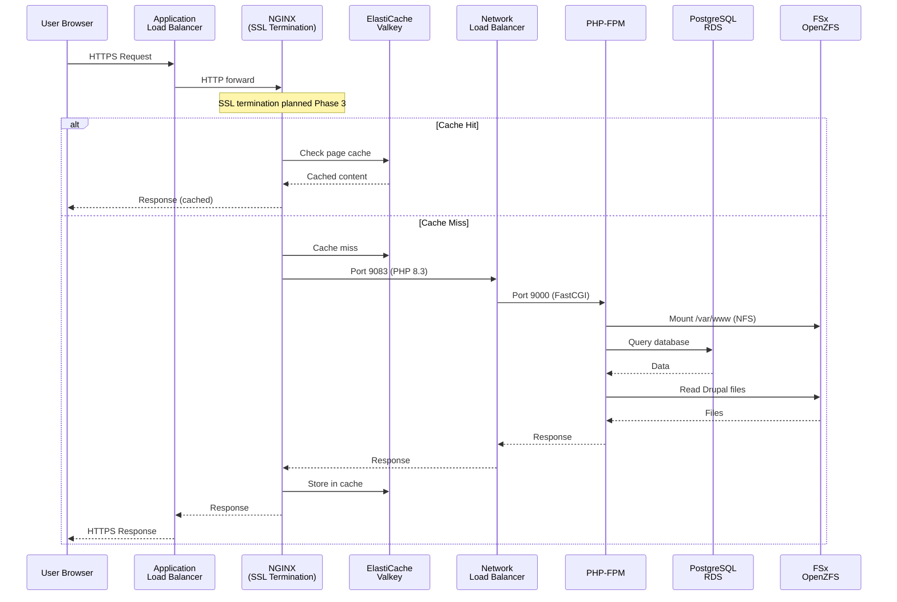
```mermaid
sequenceDiagram
    participant User as User Browser
    participant ALB as Application<br/>Load Balancer
    participant NGINX as NGINX<br/>(SSL Termination)
    participant Cache as ElastiCache<br/>Valkey
    participant NLB as Network<br/>Load Balancer
    participant PHP as PHP-FPM
    participant RDS as PostgreSQL<br/>RDS
    participant FSx as FSx<br/>OpenZFS

    User->>ALB: HTTPS Request
    ALB->>NGINX: HTTP forward
    Note over NGINX: SSL termination planned Phase 3

    alt Cache Hit
        NGINX->>Cache: Check page cache
        Cache-->>NGINX: Cached content
        NGINX-->>User: Response (cached)
    else Cache Miss
        NGINX->>Cache: Cache miss
        NGINX->>NLB: Port 9083 (PHP 8.3)
        NLB->>PHP: Port 9000 (FastCGI)
        PHP->>FSx: Mount /var/www (NFS)
        PHP->>RDS: Query database
        RDS-->>PHP: Data
        PHP->>FSx: Read Drupal files
        FSx-->>PHP: Files
        PHP-->>NLB: Response
        NLB-->>NGINX: Response
        NGINX->>Cache: Store in cache
        NGINX-->>ALB: Response
        ALB-->>User: HTTPS Response
    end
```

### PHP Version Port Mapping

The Network Load Balancer routes requests based on port number:

| Port | PHP Version | Use Case |
|------|-------------|----------|
| 9072 | PHP 7.2 | Legacy Drupal 7 sites |
| 9074 | PHP 7.4 | Drupal 8, 9 sites |
| 9081 | PHP 8.1 | Drupal 9, 10 sites |
| 9083 | PHP 8.3 | Drupal 10, 11 sites |

**NGINX Configuration Example:**
```nginx
upstream php74 {
    server nlb-internal.example.com:9074;
}

upstream php83 {
    server nlb-internal.example.com:9083;
}

location ~ \.php$ {
    # Route based on Drupal version
    fastcgi_pass php83;  # or php74 for older sites
    fastcgi_index index.php;
    include fastcgi_params;
}
```

## Auto Scaling Architecture

### Instance Lifecycle

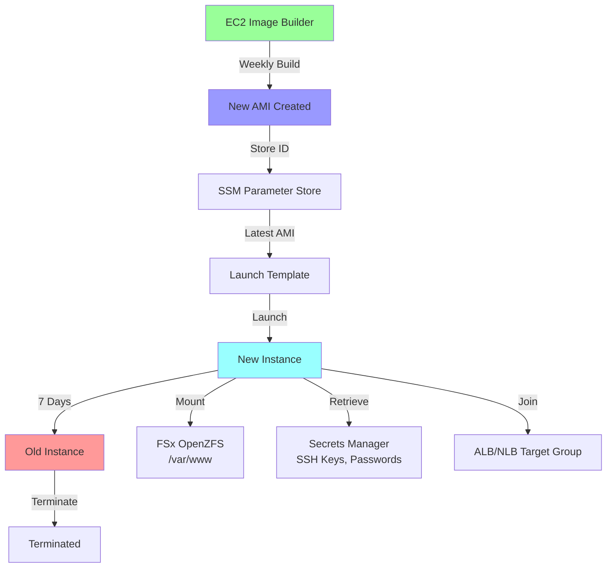
```mermaid
graph TD
    ImageBuilder[EC2 Image Builder] -->|Weekly Build| AMI[New AMI Created]
    AMI -->|Store ID| SSM[SSM Parameter Store]
    SSM -->|Latest AMI| LaunchTemplate[Launch Template]
    LaunchTemplate -->|Launch| NewInstance[New Instance]
    NewInstance -->|7 Days| OldInstance[Old Instance]
    OldInstance -->|Terminate| Terminated[Terminated]

    NewInstance -->|Mount| FSx[FSx OpenZFS<br/>/var/www]
    NewInstance -->|Retrieve| Secrets[Secrets Manager<br/>SSH Keys, Passwords]
    NewInstance -->|Join| TargetGroup[ALB/NLB Target Group]

    style ImageBuilder fill:#9f9
    style AMI fill:#99f
    style NewInstance fill:#9ff
    style OldInstance fill:#f99
```

**Key Features:**
- **Immutable infrastructure:** Instances replaced every 7 days
- **No configuration drift:** Fresh from AMI each time
- **Zero-downtime:** New instances launched before old ones terminate
- **Automated:** No manual intervention required

### Scaling Triggers

#### NGINX Scaling
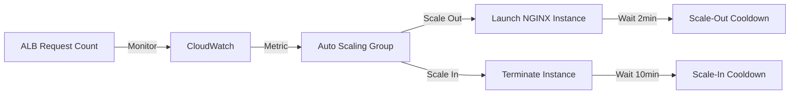
```mermaid
graph LR
    ALB[ALB Request Count] -->|Monitor| CW[CloudWatch]
    CW -->|Metric| ASG[Auto Scaling Group]
    ASG -->|Scale Out| NewNginx[Launch NGINX Instance]
    ASG -->|Scale In| RemoveNginx[Terminate Instance]

    NewNginx -->|Wait 2min| Cooldown[Scale-Out Cooldown]
    RemoveNginx -->|Wait 10min| Cooldown2[Scale-In Cooldown]
```

**Scaling Policy:**
- Min instances: 2
- Max instances: 4
- Scale out: ALB request count > 1000/min OR CPU > 60%
- Scale in: ALB request count < 500/min AND CPU < 30%
- Cooldown: 2min (scale-out), 10min (scale-in)

#### PHP-FPM Scaling

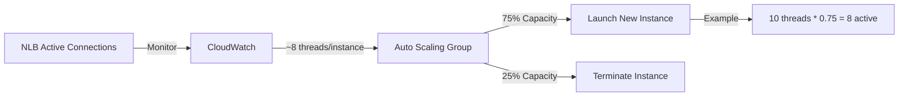
```mermaid
graph LR
    NLB[NLB Active Connections] -->|Monitor| CW[CloudWatch]
    CW -->|~8 threads/instance| ASG[Auto Scaling Group]
    ASG -->|75% Capacity| ScaleOut[Launch New Instance]
    ASG -->|25% Capacity| ScaleIn[Terminate Instance]

    ScaleOut -->|Example| Calc[10 threads * 0.75 = 8 active]
```

**Scaling Policy (per PHP version):**
- Min instances: 2
- Max instances: 8
- Scale out: Active connections > 8 per instance (75% of 10 threads)
- Scale in: Active connections < 3 per instance (25% capacity)
- Cooldown: 3min (scale-out), 10min (scale-in)

## Compute Layer Templates

The compute layer is deployed as four independent CloudFormation stacks, in order:

### Deployment Order and Dependencies

```
ALB (cf-compute-alb.yaml)
 └→ NLB (cf-compute-nlb.yaml)
     └→ NGINX (cf-compute-nginx.yaml) ← registers with ALB target group
         └→ PHP-FPM (cf-compute-php.yaml) ← registers with NLB target groups
```

### Stack Details

| Template | Purpose | Key Resources |
|----------|---------|---------------|
| `cf-compute-alb.yaml` | Public entry point | Internet-facing ALB, HTTP→HTTPS redirect, NGINX target group |
| `cf-compute-nlb.yaml` | Internal PHP routing | Internal NLB, TCP listeners (9074, 9083), PHP target groups |
| `cf-compute-nginx.yaml` | Reverse proxy tier | Launch template, ASG (min 2, max 4), CPU + request-count scaling |
| `cf-compute-php.yaml` | Application tier | Conditional ASGs per PHP version (7.4, 8.3), flow-count scaling |

### NLB Health Checks

The NLB target groups use **TCP health checks on port 9000** (FastCGI) to verify PHP-FPM availability. This is a temporary configuration -- the target design uses HTTP health checks on port 9100 via a lightweight NGINX sidecar that proxies to a `health.php` script over FastCGI. The HTTP/9100 approach is under investigation due to a FastCGI 502 bug. Once resolved, the health checks will be switched to `HTTP /health` on port 9100.

### SSM Parameters (Compute Layer)

These SSM parameters are created by compute stacks for boot script discovery:

| Parameter | Created By | Used By | Purpose |
|-----------|-----------|---------|---------|
| `/environment/name` | cf-compute-alb.yaml | All instances | Environment identification |
| `/nlb/endpoint` | cf-compute-nlb.yaml | NGINX instances | NLB DNS for upstream configuration |

### Makefile Targets

```bash
# Deploy (in order: ALB → NLB → NGINX → PHP)
make deploy-compute ENV=production        # All compute stacks
make deploy-compute-alb ENV=production    # Just ALB
make deploy-compute-nlb ENV=production    # Just NLB
make deploy-compute-nginx ENV=production  # Just NGINX ASG
make deploy-compute-php ENV=production    # Just PHP-FPM ASGs

# Verify
make verify-compute ENV=production        # All compute stacks

# Destroy (reverse order: PHP → NGINX → NLB → ALB)
make destroy-compute ENV=production       # All compute stacks
```

### Security Hardening

All compute instances enforce:
- **IMDSv2 optional** (`HttpTokens: optional`) -- temporary; current AMIs use IMDSv1 metadata calls, pending rebuild to support IMDSv2-only. Target state is `HttpTokens: required`.
- **EBS encryption** enabled on all volumes
- **gp3 volumes** for consistent performance
- **7-day MaxInstanceLifetime** (604800 seconds) for immutable infrastructure

## Storage Architecture

### FSx for OpenZFS

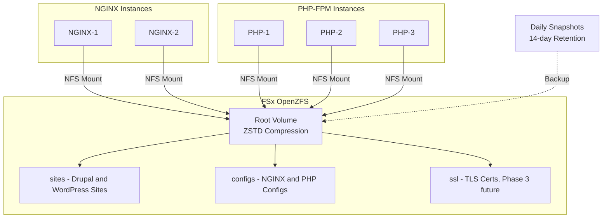
```mermaid
graph TB
    subgraph "FSx OpenZFS"
        Root[Root Volume<br/>ZSTD Compression]
        Sites["sites - Drupal and WordPress Sites"]
        Configs["configs - NGINX and PHP Configs"]
        SSL["ssl - TLS Certs, Phase 3 future"]
    end

    subgraph "NGINX Instances"
        Nginx1[NGINX-1] -->|NFS Mount| Root
        Nginx2[NGINX-2] -->|NFS Mount| Root
    end

    subgraph "PHP-FPM Instances"
        PHP1[PHP-1] -->|NFS Mount| Root
        PHP2[PHP-2] -->|NFS Mount| Root
        PHP3[PHP-3] -->|NFS Mount| Root
    end

    Root --> Sites
    Root --> Configs
    Root --> SSL

    Backup[Daily Snapshots<br/>14-day Retention] -.->|Backup| Root
```

**Mount Point:** `/var/www` on all instances

**Features:**
- **Shared storage:** Same files on all NGINX and PHP-FPM instances
- **NFS v4.1:** Better performance than EFS for small files
- **Compression:** ZSTD reduces storage costs
- **Snapshots:** Daily automatic backups, 14-day retention
- **Auto-scaling:** Storage grows automatically (100GB → 1TB)

**Why Not EFS?**
- EFS deployment time: **20+ minutes** (unacceptable)
- FSx deployment time: **<90 seconds** (proven in production)
- Better small-file performance (Drupal has thousands of small PHP files)

### S3 Buckets

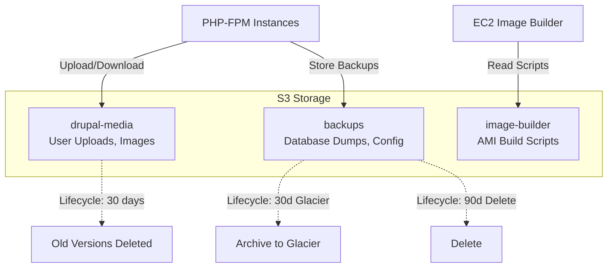
```mermaid
graph TB
    subgraph "S3 Storage"
        Media[drupal-media<br/>User Uploads, Images]
        Backup[backups<br/>Database Dumps, Config]
        ImageBuilder[image-builder<br/>AMI Build Scripts]
    end

    PHP[PHP-FPM Instances] -->|Upload/Download| Media
    PHP -->|Store Backups| Backup
    ImgBldr[EC2 Image Builder] -->|Read Scripts| ImageBuilder

    Media -.->|Lifecycle: 30 days| MediaOld[Old Versions Deleted]
    Backup -.->|Lifecycle: 30d Glacier| BackupArchive[Archive to Glacier]
    Backup -.->|Lifecycle: 90d Delete| BackupDelete[Delete]
```

## Database Architecture

### RDS PostgreSQL Multi-AZ

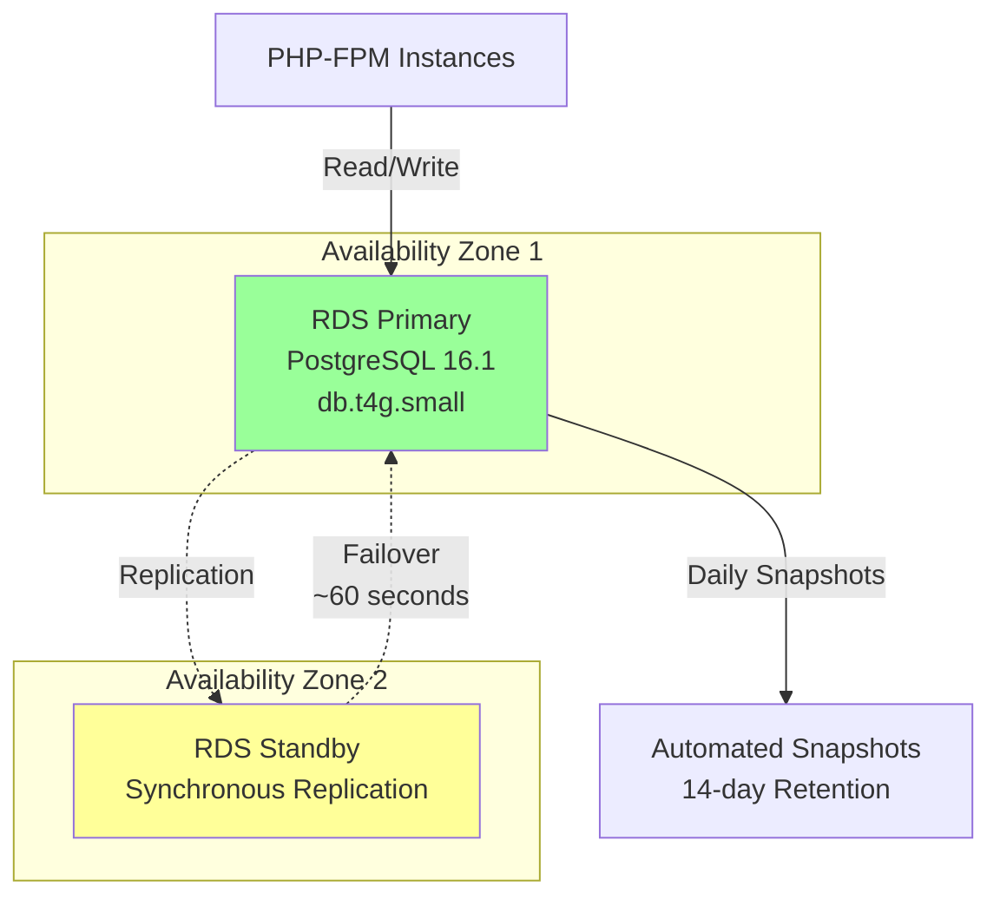
```mermaid
graph TB
    subgraph "Availability Zone 1"
        Primary[RDS Primary<br/>PostgreSQL 16.1<br/>db.t4g.small]
    end

    subgraph "Availability Zone 2"
        Standby[RDS Standby<br/>Synchronous Replication]
    end

    PHP1[PHP-FPM Instances] -->|Read/Write| Primary
    Primary -.->|Replication| Standby

    Primary -->|Daily Snapshots| Snapshots[Automated Snapshots<br/>14-day Retention]

    Standby -.->|Failover<br/>~60 seconds| Primary

    style Primary fill:#9f9
    style Standby fill:#ff9
```

**Features:**
- **Multi-AZ:** Automatic failover in ~60 seconds
- **Automated backups:** 14 days retention
- **Encryption:** At rest and in transit
- **Parameter tuning:** Optimized for Drupal workload

**Connection Details (from Secrets Manager):**
```json
{
  "engine": "postgres",
  "host": "production-postgres.xyz.us-east-1.rds.amazonaws.com",
  "port": 5432,
  "database": "drupal",
  "username": "dbadmin"
}
```

## SSL Certificate Management -- Phase 3 (Future)

SSL termination via Let's Encrypt and CertBot is **planned but not yet implemented**. The current infrastructure passes traffic as HTTP between the ALB and NGINX. The design below is the target architecture for a future phase.

### Let's Encrypt DNS-01 Challenge (Planned)

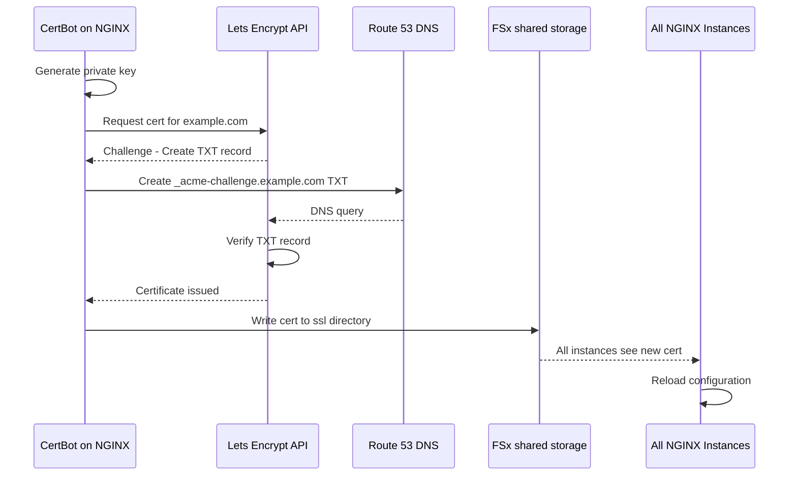
```mermaid
sequenceDiagram
    participant CertBot as CertBot on NGINX
    participant LE as Lets Encrypt API
    participant R53 as Route 53 DNS
    participant FSx as FSx shared storage
    participant NGINX as All NGINX Instances

    CertBot->>CertBot: Generate private key
    CertBot->>LE: Request cert for example.com
    LE-->>CertBot: Challenge - Create TXT record
    CertBot->>R53: Create _acme-challenge.example.com TXT
    R53-->>LE: DNS query
    LE->>LE: Verify TXT record
    LE-->>CertBot: Certificate issued
    CertBot->>FSx: Write cert to ssl directory
    FSx-->>NGINX: All instances see new cert
    NGINX->>NGINX: Reload configuration
```

**Why DNS-01 instead of HTTP-01?**
- **Works with multiple NGINX instances:** No routing issues
- **No ALB dependency:** CertBot doesn't need HTTP access
- **Wildcard certs:** Can generate `*.example.com` certificates
- **Private instances:** NGINX has no public IP

**CertBot Renewal (Planned):**
```bash
# Cron job on NGINX instances (runs daily)
0 2 * * * certbot renew --dns-route53 --deploy-hook "systemctl reload nginx"
```

## IAM Roles and Permissions

### NGINX Instance Role

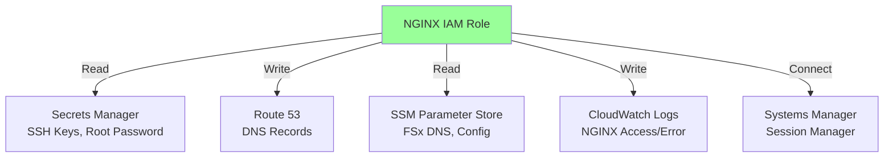
```mermaid
graph TB
    NginxRole[NGINX IAM Role]

    NginxRole -->|Read| Secrets[Secrets Manager<br/>SSH Keys, Root Password]
    NginxRole -->|Write| R53[Route 53<br/>DNS Records]
    NginxRole -->|Read| SSM[SSM Parameter Store<br/>FSx DNS, Config]
    NginxRole -->|Write| CW[CloudWatch Logs<br/>NGINX Access/Error]
    NginxRole -->|Connect| SessionMgr[Systems Manager<br/>Session Manager]

    style NginxRole fill:#9f9
```

**Key Permissions:**
- `secretsmanager:GetSecretValue` - Retrieve SSH keys, passwords
- `route53:ChangeResourceRecordSets` - CertBot DNS-01 validation
- `ssm:GetParameter` - Read FSx mount info, configuration
- `logs:PutLogEvents` - Send logs to CloudWatch
- `ssmmessages:*` - Session Manager access

### PHP-FPM Instance Role

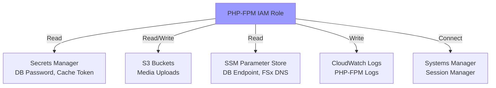
```mermaid
graph TB
    PHPRole[PHP-FPM IAM Role]

    PHPRole -->|Read| Secrets[Secrets Manager<br/>DB Password, Cache Token]
    PHPRole -->|Read/Write| S3[S3 Buckets<br/>Media Uploads]
    PHPRole -->|Read| SSM[SSM Parameter Store<br/>DB Endpoint, FSx DNS]
    PHPRole -->|Write| CW[CloudWatch Logs<br/>PHP-FPM Logs]
    PHPRole -->|Connect| SessionMgr[Systems Manager<br/>Session Manager]

    style PHPRole fill:#99f
```

**Key Permissions:**
- `secretsmanager:GetSecretValue` - Database and cache credentials
- `s3:GetObject`, `s3:PutObject` - Drupal media uploads
- `ssm:GetParameter` - RDS endpoint, FSx mount info
- `logs:PutLogEvents` - Send logs to CloudWatch
- `ssmmessages:*` - Session Manager access

## Monitoring and Observability

### CloudWatch Metrics (Optional)

When `EnableCompliance: true` is set:

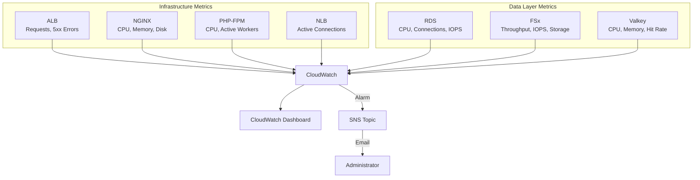
```mermaid
graph TB
    subgraph "Infrastructure Metrics"
        ALB[ALB<br/>Requests, 5xx Errors]
        NGINX[NGINX<br/>CPU, Memory, Disk]
        PHP[PHP-FPM<br/>CPU, Active Workers]
        NLB[NLB<br/>Active Connections]
    end

    subgraph "Data Layer Metrics"
        RDS[RDS<br/>CPU, Connections, IOPS]
        FSx[FSx<br/>Throughput, IOPS, Storage]
        Valkey[Valkey<br/>CPU, Memory, Hit Rate]
    end

    ALB --> CW[CloudWatch]
    NGINX --> CW
    PHP --> CW
    NLB --> CW
    RDS --> CW
    FSx --> CW
    Valkey --> CW

    CW --> Dashboard[CloudWatch Dashboard]
    CW -->|Alarm| SNS[SNS Topic]
    SNS -->|Email| Admin[Administrator]
```

**Key Alarms:**
- ALB 5xx errors > 10/5min
- RDS CPU > 80%
- FSx throughput > 90% capacity
- Auto Scaling approaching max instances
- RDS connections > 90% of max

### VPC Flow Logs (Compliance)

When `EnableVPCFlowLogs: true`:

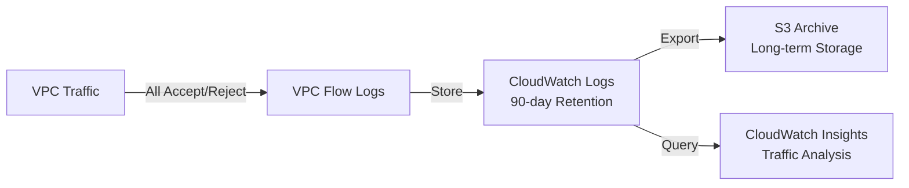
```mermaid
graph LR
    VPC[VPC Traffic] -->|All Accept/Reject| FlowLogs[VPC Flow Logs]
    FlowLogs -->|Store| CW[CloudWatch Logs<br/>90-day Retention]
    CW -->|Export| S3[S3 Archive<br/>Long-term Storage]

    CW -->|Query| Insights[CloudWatch Insights<br/>Traffic Analysis]
```

**Use Cases:**
- Security incident investigation
- Traffic pattern analysis
- Compliance auditing (ISO 27001)

## High Availability Design

### Failure Scenarios

| Component | Failure Mode | Recovery Time | Impact |
|-----------|--------------|---------------|---------|
| **Single NGINX instance** | Instance terminated | 2-3 minutes | None (ALB routes to healthy instances) |
| **All NGINX instances** | AZ failure | 5 minutes | Downtime (ALB health checks fail) |
| **Single PHP-FPM instance** | Instance terminated | 2-3 minutes | None (NLB routes to healthy instances) |
| **RDS Primary** | Instance failure | ~60 seconds | Brief connection errors (automatic failover) |
| **FSx File System** | File system issue | 5-10 minutes | Downtime (AWS restores from snapshot) |
| **ElastiCache Valkey** | Node failure | Immediate | Cache miss (performance impact, no downtime) |
| **NAT Gateway** | Gateway failure | Immediate | No outbound internet (inbound traffic unaffected) |
| **Availability Zone** | Complete AZ failure | 2-5 minutes | No downtime (Multi-AZ resources failover) |

### Recovery Procedures

#### Manual Rollback (AMI Issue)

If a new AMI causes issues:

1. Identify previous working AMI:
   ```bash
   aws ec2 describe-images --owners self --filters "Name=name,Values=production-nginx-*" | jq -r '.Images | sort_by(.CreationDate) | .[-2].ImageId'
   ```

2. Update SSM Parameter:
   ```bash
   aws ssm put-parameter --name /production/ami/nginx --value ami-old12345 --overwrite
   ```

3. Trigger instance refresh:
   ```bash
   aws autoscaling start-instance-refresh --auto-scaling-group-name production-nginx-asg
   ```

4. Instances will gradually replace with old AMI (rolling update, no downtime)

## Performance Optimization

### Caching Strategy

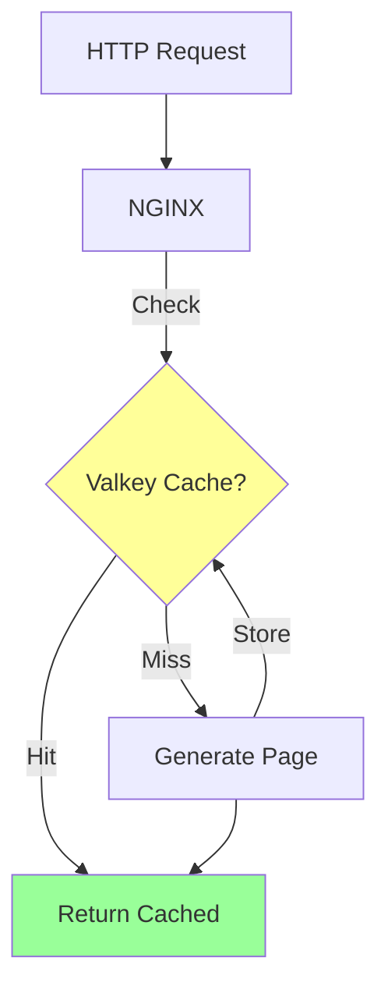
```mermaid
graph TD
    Request[HTTP Request] --> NGINX
    NGINX -->|Check| Valkey{Valkey Cache?}
    Valkey -->|Hit| Response[Return Cached]
    Valkey -->|Miss| PHP[Generate Page]
    PHP -->|Store| Valkey
    PHP --> Response

    style Valkey fill:#ff9
    style Response fill:#9f9
```

**Cache Layers:**
1. **Valkey (Page Cache):** Full HTML pages, 15-minute TTL
2. **OpCache (PHP):** Compiled PHP bytecode, in-memory
3. **PostgreSQL Query Cache:** Database query results

**Expected Hit Rates:**
- Valkey page cache: **70-90%** (anonymous users)
- OpCache: **100%** (always enabled)
- Database query cache: **50-70%**

### Database Tuning

Parameter group optimizations for Drupal:

```sql
max_connections = 300              -- Support many PHP-FPM workers
shared_buffers = {DBInstanceMemory/4}  -- 25% of RAM
effective_cache_size = {DBInstanceMemory*3/4}  -- 75% of RAM
maintenance_work_mem = {DBInstanceMemory/16}
checkpoint_completion_target = 0.9
wal_buffers = 16MB
random_page_cost = 1.1              -- SSD-optimized
effective_io_concurrency = 200
```

## Security Best Practices

### Defense in Depth

**Layer 1: Network (VPC)**
- No public IPs except ALB
- Security groups isolate tiers
- NACLs (optional) for subnet-level filtering

**Layer 2: Instance (IAM)**
- Least privilege IAM roles
- No SSH keys in user-data (Secrets Manager)
- Session Manager for audited access

**Layer 3: Application (Drupal)**
- Input validation
- Prepared statements (SQL injection prevention)
- CSRF tokens
- Content Security Policy headers

**Layer 4: Data (Encryption)**
- RDS encryption at rest (KMS)
- FSx encryption at rest
- S3 encryption (SSE-S3)
- Valkey encryption in transit
- SSL/TLS for all connections

### Secrets Management

**Never Hardcode:**
- Database passwords
- SSH private keys
- API tokens
- Root passwords

**Always Use Secrets Manager:**
```bash
# Retrieve database password
DB_PASSWORD=$(aws secretsmanager get-secret-value \
  --secret-id worxco/production/rds/master-password \
  --query SecretString --output text | jq -r .password)
```

## Future Enhancements

### Phase 2: IMDSv2 Enforcement and HTTP Health Checks

- **IMDSv2 required**: Rebuild AMIs to remove IMDSv1 metadata calls, then set `HttpTokens: required` on all launch templates
- **HTTP health checks on port 9100**: Resolve FastCGI 502 bug in micro-NGINX sidecar, then switch NLB target groups from TCP/9000 to HTTP/9100

### Phase 3: SSL Termination via Let's Encrypt

- **CertBot DNS-01**: Install CertBot on NGINX instances, automate certificate issuance via Route 53
- **Shared cert storage**: Write certificates to FSx so all NGINX instances pick them up
- **Auto-renewal cron**: Daily CertBot renewal with NGINX reload hook

See the [SSL Certificate Management](#ssl-certificate-management----phase-3-future) section for the full design.

### Phase 4: LaTeX PDF Service

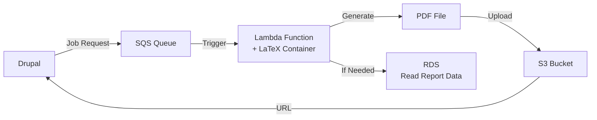
```mermaid
graph LR
    Drupal[Drupal] -->|Job Request| SQS[SQS Queue]
    SQS -->|Trigger| Lambda[Lambda Function<br/>+ LaTeX Container]
    Lambda -->|Generate| PDF[PDF File]
    PDF -->|Upload| S3[S3 Bucket]
    S3 -->|URL| Drupal

    Lambda -->|If Needed| RDS[RDS<br/>Read Report Data]
```

**Benefits:**
- **Serverless:** No dedicated instances
- **Scalable:** Handles 1 or 1000 reports
- **Cost-effective:** Pay only for execution time (<90s per report)

---

<sub>**License:** GPL-2.0-or-later | **Copyright:** © 2026 The Worx Company | **Author:** Kurt Vanderwater <<kurt@worxco.net>></sub>
