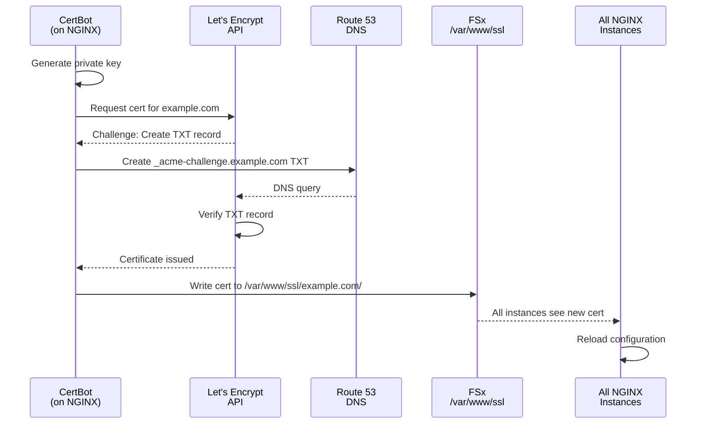

# Architecture Documentation

## Overview

The cf-scalable-web infrastructure is designed for high-availability, security, and scalability. It uses a multi-tier architecture with defense-in-depth security principles.

## Network Architecture

### VPC Layout

The VPC uses a 4-tier private subnet architecture plus a public subnet tier:


**Key Points:**
- Only public IPs on ALB
- Each tier isolated by security groups
- NAT Gateways provide outbound internet (for updates, Let's Encrypt, etc.)
- Multi-AZ deployment across 2 availability zones

### Security Group Architecture


**Security Principles:**
- **No lateral movement:** Each tier can only communicate with adjacent tiers
- **Least privilege:** Only required ports open
- **Defense in depth:** Multiple layers of security

## Request Flow

### HTTP/HTTPS Request Flow


### PHP Version Port Mapping

The Network Load Balancer routes requests based on port number:

| Port | PHP Version | Use Case |
|------|-------------|----------|
| 1072 | PHP 7.2 | Legacy Drupal 7 sites |
| 1074 | PHP 7.4 | Drupal 8, 9 sites |
| 1081 | PHP 8.1 | Drupal 9, 10 sites |
| 1083 | PHP 8.3 | Drupal 10, 11 sites |

**NGINX Configuration Example:**
```nginx
upstream php74 {
    server nlb-internal.example.com:1074;
}

upstream php83 {
    server nlb-internal.example.com:1083;
}

location ~ \.php$ {
    # Route based on Drupal version
    fastcgi_pass php83;  # or php74 for older sites
    fastcgi_index index.php;
    include fastcgi_params;
}
```

## Auto Scaling Architecture

### Instance Lifecycle


**Key Features:**
- **Immutable infrastructure:** Instances replaced every 7 days
- **No configuration drift:** Fresh from AMI each time
- **Zero-downtime:** New instances launched before old ones terminate
- **Automated:** No manual intervention required

### Scaling Triggers

#### NGINX Scaling


**Scaling Policy:**
- Min instances: 2
- Max instances: 4
- Scale out: ALB request count > 1000/min OR CPU > 60%
- Scale in: ALB request count < 500/min AND CPU < 30%
- Cooldown: 2min (scale-out), 10min (scale-in)

#### PHP-FPM Scaling


**Scaling Policy (per PHP version):**
- Min instances: 2
- Max instances: 8
- Scale out: Active connections > 8 per instance (75% of 10 threads)
- Scale in: Active connections < 3 per instance (25% capacity)
- Cooldown: 3min (scale-out), 10min (scale-in)

## Storage Architecture

### FSx for OpenZFS

```mermaid
graph TB
    subgraph "FSx OpenZFS"
        Root[Root Volume<br/>ZSTD Compression]
        Sites[/fsx/sites<br/>Drupal/WordPress Sites]
        Configs[/fsx/configs<br/>NGINX/PHP Configs]
        SSL[/fsx/ssl<br/>Let's Encrypt Certs]
    end

    subgraph "NGINX Instances"
        Nginx1[NGINX-1] -->|NFS Mount| Root
        Nginx2[NGINX-2] -->|NFS Mount| Root
    end

    subgraph "PHP-FPM Instances"
        PHP1[PHP-1] -->|NFS Mount| Root
        PHP2[PHP-2] -->|NFS Mount| Root
        PHP3[PHP-3] -->|NFS Mount| Root
    end

    Root --> Sites
    Root --> Configs
    Root --> SSL

    Backup[Daily Snapshots<br/>14-day Retention] -.->|Backup| Root
```

**Mount Point:** `/var/www` on all instances

**Features:**
- **Shared storage:** Same files on all NGINX and PHP-FPM instances
- **NFS v4.1:** Better performance than EFS for small files
- **Compression:** ZSTD reduces storage costs
- **Snapshots:** Daily automatic backups, 14-day retention
- **Auto-scaling:** Storage grows automatically (100GB → 1TB)

**Why Not EFS?**
- EFS deployment time: **20+ minutes** (unacceptable)
- FSx deployment time: **<90 seconds** (proven in production)
- Better small-file performance (Drupal has thousands of small PHP files)

### S3 Buckets


## Database Architecture

### RDS PostgreSQL Multi-AZ

```mermaid
graph TB
    subgraph "Availability Zone 1"
        Primary[RDS Primary<br/>PostgreSQL 16.1<br/>db.t4g.small]
    end

    subgraph "Availability Zone 2"
        Standby[RDS Standby<br/>(Synchronous Replication)]
    end

    PHP1[PHP-FPM Instances] -->|Read/Write| Primary
    Primary -.->|Replication| Standby

    Primary -->|Daily Snapshots| Snapshots[Automated Snapshots<br/>14-day Retention]

    Standby -.->|Failover<br/>~60 seconds| Primary

    style Primary fill:#9f9
    style Standby fill:#ff9
```

**Features:**
- **Multi-AZ:** Automatic failover in ~60 seconds
- **Automated backups:** 14 days retention
- **Encryption:** At rest and in transit
- **Parameter tuning:** Optimized for Drupal workload

**Connection Details (from Secrets Manager):**
```json
{
  "engine": "postgres",
  "host": "production-postgres.xyz.us-east-1.rds.amazonaws.com",
  "port": 5432,
  "database": "drupal",
  "username": "dbadmin"
}
```

## SSL Certificate Management

### Let's Encrypt DNS-01 Challenge



**Why DNS-01 instead of HTTP-01?**
- **Works with multiple NGINX instances:** No routing issues
- **No ALB dependency:** CertBot doesn't need HTTP access
- **Wildcard certs:** Can generate `*.example.com` certificates
- **Private instances:** NGINX has no public IP

**CertBot Renewal (Automated):**
```bash
# Cron job on NGINX instances (runs daily)
0 2 * * * certbot renew --dns-route53 --deploy-hook "systemctl reload nginx"
```

## IAM Roles and Permissions

### NGINX Instance Role


**Key Permissions:**
- `secretsmanager:GetSecretValue` - Retrieve SSH keys, passwords
- `route53:ChangeResourceRecordSets` - CertBot DNS-01 validation
- `ssm:GetParameter` - Read FSx mount info, configuration
- `logs:PutLogEvents` - Send logs to CloudWatch
- `ssmmessages:*` - Session Manager access (no bastion needed)

### PHP-FPM Instance Role


**Key Permissions:**
- `secretsmanager:GetSecretValue` - Database and Redis credentials
- `s3:GetObject`, `s3:PutObject` - Drupal media uploads
- `ssm:GetParameter` - RDS endpoint, FSx mount info
- `logs:PutLogEvents` - Send logs to CloudWatch
- `ssmmessages:*` - Session Manager access

## Monitoring and Observability

### CloudWatch Metrics (Optional)

When `EnableCompliance: true` is set:


**Key Alarms:**
- ALB 5xx errors > 10/5min
- RDS CPU > 80%
- FSx throughput > 90% capacity
- Auto Scaling approaching max instances
- RDS connections > 90% of max

### VPC Flow Logs (Compliance)

When `EnableVPCFlowLogs: true`:


**Use Cases:**
- Security incident investigation
- Traffic pattern analysis
- Compliance auditing (ISO 27001)

## High Availability Design

### Failure Scenarios

| Component | Failure Mode | Recovery Time | Impact |
|-----------|--------------|---------------|---------|
| **Single NGINX instance** | Instance terminated | 2-3 minutes | None (ALB routes to healthy instances) |
| **All NGINX instances** | AZ failure | 5 minutes | Downtime (ALB health checks fail) |
| **Single PHP-FPM instance** | Instance terminated | 2-3 minutes | None (NLB routes to healthy instances) |
| **RDS Primary** | Instance failure | ~60 seconds | Brief connection errors (automatic failover) |
| **FSx File System** | File system issue | 5-10 minutes | Downtime (AWS restores from snapshot) |
| **ElastiCache Redis** | Node failure | Immediate | Cache miss (performance impact, no downtime) |
| **NAT Gateway** | Gateway failure | Immediate | No outbound internet (inbound traffic unaffected) |
| **Availability Zone** | Complete AZ failure | 2-5 minutes | No downtime (Multi-AZ resources failover) |

### Recovery Procedures

#### Manual Rollback (AMI Issue)

If a new AMI causes issues:

1. Identify previous working AMI:
   ```bash
   aws ec2 describe-images --owners self --filters "Name=name,Values=production-nginx-*" | jq -r '.Images | sort_by(.CreationDate) | .[-2].ImageId'
   ```

2. Update SSM Parameter:
   ```bash
   aws ssm put-parameter --name /production/ami/nginx --value ami-old12345 --overwrite
   ```

3. Trigger instance refresh:
   ```bash
   aws autoscaling start-instance-refresh --auto-scaling-group-name production-nginx-asg
   ```

4. Instances will gradually replace with old AMI (rolling update, no downtime)

## Performance Optimization

### Caching Strategy


**Cache Layers:**
1. **Redis (Page Cache):** Full HTML pages, 15-minute TTL
2. **OpCache (PHP):** Compiled PHP bytecode, in-memory
3. **PostgreSQL Query Cache:** Database query results

**Expected Hit Rates:**
- Redis page cache: **70-90%** (anonymous users)
- OpCache: **100%** (always enabled)
- Database query cache: **50-70%**

### Database Tuning

Parameter group optimizations for Drupal:

```sql
max_connections = 300              -- Support many PHP-FPM workers
shared_buffers = {DBInstanceMemory/4}  -- 25% of RAM
effective_cache_size = {DBInstanceMemory*3/4}  -- 75% of RAM
maintenance_work_mem = {DBInstanceMemory/16}
checkpoint_completion_target = 0.9
wal_buffers = 16MB
random_page_cost = 1.1              -- SSD-optimized
effective_io_concurrency = 200
```

## Security Best Practices

### Defense in Depth

**Layer 1: Network (VPC)**
- No public IPs except ALB
- Security groups isolate tiers
- NACLs (optional) for subnet-level filtering

**Layer 2: Instance (IAM)**
- Least privilege IAM roles
- No SSH keys in user-data (Secrets Manager)
- Session Manager for audited access

**Layer 3: Application (Drupal)**
- Input validation
- Prepared statements (SQL injection prevention)
- CSRF tokens
- Content Security Policy headers

**Layer 4: Data (Encryption)**
- RDS encryption at rest (KMS)
- FSx encryption at rest
- S3 encryption (SSE-S3)
- Redis encryption in transit
- SSL/TLS for all connections

### Secrets Management

**Never Hardcode:**
- Database passwords
- SSH private keys
- API tokens
- Root passwords

**Always Use Secrets Manager:**
```bash
# Retrieve database password
DB_PASSWORD=$(aws secretsmanager get-secret-value \
  --secret-id worxco/production/rds/master-password \
  --query SecretString --output text | jq -r .password)
```

## Future Enhancements

### Phase 2: LaTeX PDF Service


**Benefits:**
- **Serverless:** No dedicated instances
- **Scalable:** Handles 1 or 1000 reports
- **Cost-effective:** Pay only for execution time (<90s per report)

---

<sub>**License:** GPL-2.0-or-later | **Copyright:** © 2026 The Worx Company | **Author:** Kurt Vanderwater <<kurt@worxco.net>></sub>
