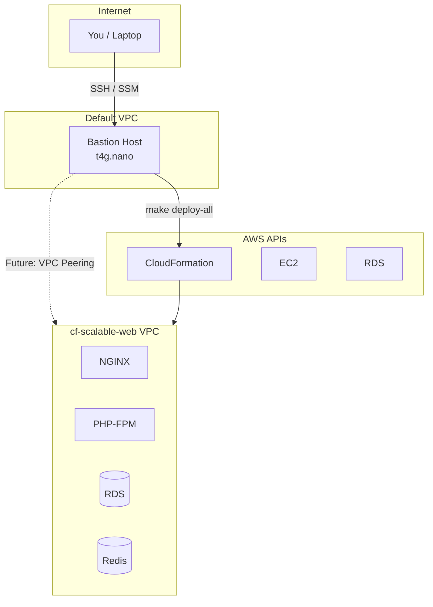

# Bastion Host Setup

This document describes the standalone bastion host for managing cf-scalable-web infrastructure deployments.

## Overview

The bastion host is a small EC2 instance that runs in the **default VPC**, separate from the project infrastructure. This design allows:

- Long-running deployments (40+ minutes) without laptop dependency
- Persistent sessions via `screen` or `tmux`
- Survival across project VPC teardowns
- SSH and SSM Session Manager access



## Architecture

| Component | Description |
|-----------|-------------|
| **Location** | Default VPC (always exists) |
| **Instance Type** | t4g.nano (ARM, ~$3/month) |
| **OS** | Ubuntu 24.04 LTS |
| **Access** | SSH (key-based) + SSM Session Manager |
| **Elastic IP** | Yes (stable address) |

### Why Separate from Project VPC?

1. **Survivability**: Project VPC can be destroyed/recreated without affecting bastion
2. **Independence**: Bastion doesn't depend on project infrastructure
3. **Simplicity**: No circular dependencies during initial deployment

### Future: VPC Peering

When EC2 instances are deployed in the project VPC, add VPC peering to enable direct SSH access:

```
Default VPC (10.0.0.0/24) <--peering--> Project VPC (10.200.0.0/16)
```

## Prerequisites

1. **AWS Account**: With default VPC intact
2. **Office/VPN IP**: For SSH security group lockdown
3. **AWS CLI**: Configured on your laptop for initial deploy

## Deployment

### 1. Configure Parameters

Edit `cloudformation/parameters/bastion.json`:

```json
{
  "Parameters": {
    "KeyPairName": "",
    "AllowedSSHCidr": "YOUR_OFFICE_IP/32",
    "InstanceType": "t4g.nano"
  }
}
```

| Parameter | Description |
|-----------|-------------|
| `KeyPairName` | Leave empty to create new key pair, or specify existing |
| `AllowedSSHCidr` | Your office/VPN IP with /32 (single IP) or /24 (range) |
| `InstanceType` | t4g.nano is sufficient for deployment tasks |

### 2. Deploy

```bash
make deploy-bastion
```

This will:
- Create security group (SSH from your IP only)
- Create IAM role (for SSM and CloudFormation access)
- Create key pair (if not specified) and store in SSM Parameter Store
- Launch EC2 instance with all tools pre-installed
- Allocate Elastic IP

### 3. Get Connection Info

```bash
make verify-bastion
```

Outputs include:
- `BastionPublicIP`: Elastic IP address
- `SSHCommand`: Ready-to-use SSH command
- `SSMCommand`: SSM Session Manager command
- `KeyPairParameterPath`: Where to retrieve the private key

### 4. Retrieve SSH Key (First Time Only)

If a new key pair was created:

```bash
# Get the parameter path from verify-bastion output
aws ssm get-parameter \
  --name /ec2/keypair/key-XXXXXXXX \
  --with-decryption \
  --query 'Parameter.Value' \
  --output text > ~/.ssh/bastion.pem

chmod 600 ~/.ssh/bastion.pem
```

### 5. Configure SSH (Optional)

Add to `~/.ssh/config` for convenience:

```
Host bastion
    HostName <elastic-ip>
    User ubuntu
    IdentityFile ~/.ssh/bastion.pem
```

Then connect with just: `ssh bastion`

## Usage

### SSH Access

```bash
ssh -i ~/.ssh/bastion.pem ubuntu@<elastic-ip>
# Or if configured in ~/.ssh/config:
ssh bastion
```

### SSM Session Manager (No Key Needed)

```bash
aws ssm start-session --target i-XXXXXXXXX
```

This works even if you lose your SSH key.

### Long-Running Deployments

```bash
# Connect to bastion
ssh bastion

# Start a persistent session
screen -S deploy

# Clone repo (first time)
cd ~/projects
git clone https://bitbucket.org/worxco/cf-scalable-web.git
cd cf-scalable-web

# Run deployment
make deploy-all ENV=sandbox

# Detach and go home
# Press: Ctrl-A, then D

# Later, reconnect
ssh bastion
screen -r deploy
```

## Pre-Installed Tools

The bastion comes with these tools installed:

| Tool | Purpose |
|------|---------|
| `aws` | AWS CLI v2 |
| `git` | Version control |
| `make` | Build automation |
| `screen` / `tmux` | Persistent sessions |
| `vim` | Text editor (set as default) |
| `tree` | Directory visualization |
| `jq` | JSON processing |
| `cfn-lint` | CloudFormation linting |
| `claude` | Claude Code CLI |
| `node` / `npm` | Node.js runtime |

## Security

### SSH Lockdown

- Security group allows SSH only from `AllowedSSHCidr`
- Update security group if your IP changes:

```bash
# Find security group
aws ec2 describe-security-groups \
  --filters "Name=group-name,Values=cf-bastion-sg" \
  --query 'SecurityGroups[0].GroupId' --output text

# Update SSH rule
aws ec2 authorize-security-group-ingress \
  --group-id sg-XXXXXXXX \
  --protocol tcp --port 22 \
  --cidr NEW_IP/32
```

### SSM Session Manager

- Provides access without SSH key
- All sessions logged to CloudTrail
- Useful for emergency access or key rotation

### IAM Role

The bastion has `PowerUserAccess` for infrastructure management. This is intentional - it needs to create/modify AWS resources.

## Teardown

```bash
make destroy-bastion
```

This deletes:
- EC2 instance
- Elastic IP
- Security group
- IAM role and instance profile
- Key pair (if created by stack)

**Note**: The private key in SSM Parameter Store is NOT deleted. Clean it up manually if needed.

## Troubleshooting

### Can't SSH

1. Check security group allows your current IP
2. Verify key permissions: `chmod 600 ~/.ssh/bastion.pem`
3. Use SSM Session Manager as backup

### Instance Not Responding

```bash
# Check instance status
aws ec2 describe-instance-status --instance-ids i-XXXXXXXX

# View console output
aws ec2 get-console-output --instance-id i-XXXXXXXX --output text
```

### Bootstrap Failed

SSH in and check:
```bash
cat /var/log/bastion-bootstrap.log
cat /var/log/bastion-bootstrap-status
```

## Cost

| Resource | Monthly Cost |
|----------|--------------|
| t4g.nano | ~$3.00 |
| Elastic IP | ~$3.65 |
| EBS (20GB gp3) | ~$1.60 |
| **Total** | **~$8.25/month** |

Stop the instance when not in use to save on compute costs (EIP still charges when not attached).

---

<sub>**License:** GPL-2.0-or-later | **Copyright:** © 2026 The Worx Company | **Author:** Kurt Vanderwater <<kurt@worxco.net>></sub>
