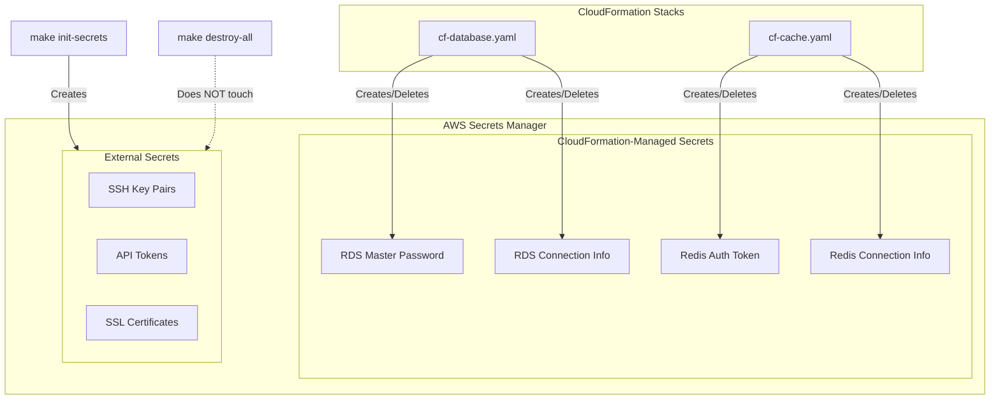
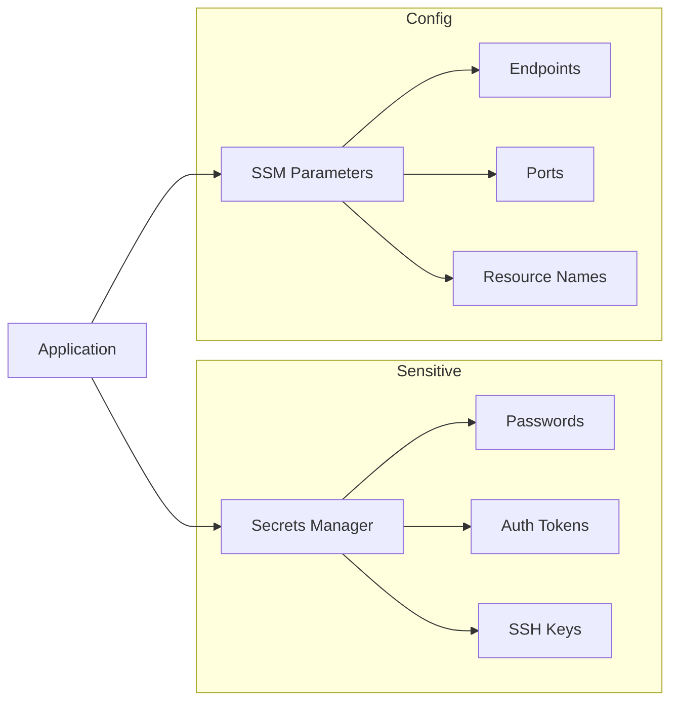

# Secrets Architecture

This document describes how secrets are managed in the cf-scalable-web infrastructure.

## Overview

There are **two types** of secrets in this architecture:

1. **CloudFormation-Managed Secrets**: Created and deleted with their stacks
2. **External Secrets**: Persist independently of stack lifecycle



## CloudFormation-Managed Secrets

These secrets are created as part of CloudFormation stacks and are **deleted when the stack is deleted**.

### Database Stack (cf-database.yaml)

| Secret | Path | Purpose |
|--------|------|---------|
| Master Password | `worxco/{env}/rds/master-password` | RDS admin credentials |
| Connection Info | `worxco/{env}/rds/connection` | Endpoint, port, database name |

**Master Password Structure**:
```json
{
  "username": "dbadmin",
  "password": "<auto-generated-32-char>"
}
```

**Connection Info Structure**:
```json
{
  "engine": "postgres",
  "host": "sandbox-postgres.xxxxx.us-east-1.rds.amazonaws.com",
  "port": 5432,
  "database": "drupal",
  "username": "dbadmin"
}
```

### Cache Stack (cf-cache.yaml)

| Secret | Path | Purpose |
|--------|------|---------|
| Auth Token | `worxco/{env}/redis/auth-token` | Redis AUTH password |
| Connection Info | `worxco/{env}/redis/connection` | Endpoint, port |

**Auth Token**: Plain alphanumeric string (32 characters)

**Connection Info Structure**:
```json
{
  "engine": "redis",
  "host": "master.sandbox-redis.xxxxx.use1.cache.amazonaws.com",
  "port": 6379,
  "auth_token_secret": "arn:aws:secretsmanager:..."
}
```

### Lifecycle

```
make deploy-database  →  Creates RDS secrets
make deploy-cache     →  Creates Redis secrets
make destroy-database →  Deletes RDS secrets
make destroy-cache    →  Deletes Redis secrets
make destroy-all      →  Deletes ALL CF-managed secrets
```

## External Secrets

These secrets are created **outside** of CloudFormation and persist across stack teardowns.

### Purpose

- **SSH Key Pairs**: EC2 instance access
- **API Tokens**: External service credentials
- **SSL Certificates**: Custom TLS certs (if not using ACM)

### Creation

```bash
make init-secrets
```

This runs `scripts/manage-secrets.sh` which creates:

| Secret | Path | Purpose |
|--------|------|---------|
| EC2 SSH Key | `worxco/{env}/ec2/ssh-keypair` | Instance SSH access |
| (Future) | `worxco/{env}/...` | Additional secrets as needed |

### Lifecycle

```
make init-secrets     →  Creates external secrets
make destroy-all      →  Does NOT touch external secrets
Manual deletion       →  Required to remove external secrets
```

### Why Separate?

1. **Data Protection**: Don't want to lose SSH keys on accidental teardown
2. **Reusability**: Same keys can be used across multiple deployments
3. **Security**: Credentials created once, rotated manually on schedule

## Retrieving Secrets

### Via AWS CLI

```bash
# List all secrets for an environment
aws secretsmanager list-secrets \
  --filter Key=name,Values=worxco/sandbox

# Get a secret value
aws secretsmanager get-secret-value \
  --secret-id worxco/sandbox/rds/master-password \
  --query 'SecretString' --output text | jq .
```

### Via Makefile

```bash
# List secrets
make list-secrets ENV=sandbox
```

### In Application Code (PHP Example)

```php
use Aws\SecretsManager\SecretsManagerClient;

$client = new SecretsManagerClient(['region' => 'us-east-1']);
$result = $client->getSecretValue([
    'SecretId' => 'worxco/production/rds/master-password'
]);
$secret = json_decode($result['SecretString'], true);
$password = $secret['password'];
```

### In Application Code (Python Example)

```python
import boto3
import json

client = boto3.client('secretsmanager', region_name='us-east-1')
response = client.get_secret_value(
    SecretId='worxco/production/rds/master-password'
)
secret = json.loads(response['SecretString'])
password = secret['password']
```

## Secret Naming Convention

```
worxco/{environment}/{service}/{secret-name}

Examples:
  worxco/sandbox/rds/master-password
  worxco/production/rds/connection
  worxco/staging/redis/auth-token
  worxco/production/ec2/ssh-keypair
```

## SSM Parameters vs Secrets Manager

This project uses **both**:

| Store | Used For | Examples |
|-------|----------|----------|
| Secrets Manager | Sensitive credentials | Passwords, tokens, keys |
| SSM Parameters | Non-sensitive config | Endpoints, ports, bucket names |



### SSM Parameters Created

```
/{env}/rds/endpoint      → RDS hostname
/{env}/rds/port          → 5432
/{env}/rds/database      → drupal
/{env}/redis/endpoint    → Redis hostname
/{env}/redis/port        → 6379
/{env}/fsx/dns           → FSx DNS name
/{env}/fsx/mount         → FSx mount path
/{env}/s3/media          → Media bucket name
/{env}/s3/backup         → Backup bucket name
```

## Secret Rotation

### Automatic (Secrets Manager)

RDS master password can be rotated automatically:

```yaml
# In cf-database.yaml (future enhancement)
SecretRotation:
  Type: AWS::SecretsManager::RotationSchedule
  Properties:
    SecretId: !Ref DBMasterPasswordSecret
    RotationRules:
      AutomaticallyAfterDays: 30
```

### Manual Rotation

For external secrets:

```bash
# Generate new value
NEW_PASSWORD=$(openssl rand -base64 32)

# Update secret
aws secretsmanager update-secret \
  --secret-id worxco/production/my-secret \
  --secret-string "$NEW_PASSWORD"
```

## Security Best Practices

1. **Least Privilege**: IAM roles only get access to secrets they need
2. **No Hardcoding**: Never put secrets in code or templates
3. **Encryption**: All secrets encrypted at rest (Secrets Manager default)
4. **Audit Trail**: CloudTrail logs all secret access
5. **Rotation**: Rotate secrets on schedule (30-90 days recommended)

## Disaster Recovery

### CloudFormation-Managed Secrets

These are recreated automatically when stacks are redeployed. No backup needed.

### External Secrets

**Important**: Back these up before any destructive operations.

```bash
# Export external secrets
aws secretsmanager list-secrets \
  --filter Key=name,Values=worxco/ \
  --query 'SecretList[].Name' --output text | while read name; do
    echo "Backing up: $name"
    aws secretsmanager get-secret-value \
      --secret-id "$name" \
      --query 'SecretString' > "backup-${name//\//-}.json"
done
```

Store backups in a secure location (not in Git!).

---

<sub>**License:** GPL-2.0-or-later | **Copyright:** © 2026 The Worx Company | **Author:** Kurt Vanderwater <<kurt@worxco.net>></sub>
