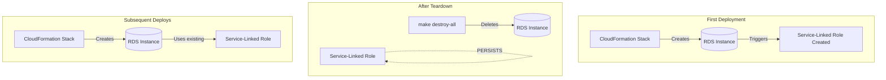

# AWS Service-Linked Roles

This document explains the AWS service-linked roles created when deploying cf-scalable-web infrastructure.

## What Are Service-Linked Roles?

Service-linked roles are a special type of IAM role that is linked directly to an AWS service. They are:

- **Auto-created**: AWS creates them automatically when you first use a service
- **Pre-configured**: Have predefined permissions that the service requires
- **Persistent**: Remain in the account even after resources are deleted
- **Account-level**: One role per service per account (not per resource)



## Roles Created by cf-scalable-web

When you deploy the cf-scalable-web infrastructure for the first time, AWS automatically creates these service-linked roles:

| Role Name | Service | Created By | Purpose |
|-----------|---------|------------|---------|
| `AWSServiceRoleForRDS` | RDS | cf-database.yaml | Allows RDS to manage resources (Enhanced Monitoring, IAM auth) |
| `AWSServiceRoleForElastiCache` | ElastiCache | cf-cache.yaml | Allows ElastiCache to manage VPC resources |
| `AWSServiceRoleForAmazonFSx` | FSx | cf-storage.yaml | Allows FSx to manage network interfaces and backups |

### AWSServiceRoleForRDS

**Created when**: First RDS instance is launched in the account

**Permissions include**:
- Create and manage network interfaces in your VPC
- Publish metrics to CloudWatch
- Create service-linked roles for RDS features

**Trust policy**: `rds.amazonaws.com`

### AWSServiceRoleForElastiCache

**Created when**: First ElastiCache cluster is launched in the account

**Permissions include**:
- Create and manage network interfaces in your VPC
- Manage security group rules for Redis/Memcached

**Trust policy**: `elasticache.amazonaws.com`

### AWSServiceRoleForAmazonFSx

**Created when**: First FSx file system is created in the account

**Permissions include**:
- Create and manage network interfaces
- Create and manage backups
- Publish metrics to CloudWatch

**Trust policy**: `fsx.amazonaws.com`

## Pre-Existing Account Roles

These roles typically exist in AWS accounts and are **not** created by cf-scalable-web:

| Role Name | Purpose |
|-----------|---------|
| `AWSServiceRoleForSupport` | AWS Support access |
| `AWSServiceRoleForTrustedAdvisor` | Trusted Advisor checks |
| `AWSServiceRoleForOrganizations` | AWS Organizations management |
| `AWSServiceRoleForComputeOptimizer` | EC2 rightsizing recommendations |
| `AWSServiceRoleForResourceExplorer` | Cross-region resource search |

## Why Aren't These Deleted?

Service-linked roles persist for several reasons:

1. **Account-wide scope**: They're not tied to specific resources
2. **Shared usage**: Other resources in the account may need them
3. **Idempotent**: AWS won't create duplicates on redeploy
4. **Low cost**: Roles have no cost - they're just IAM policies
5. **Required for service**: Deleting them would break the service

## Can They Be Deleted?

Yes, but with caveats:

```bash
# Check if a service-linked role can be deleted
aws iam get-service-linked-role-deletion-status \
  --deletion-task-id <task-id>

# Request deletion (will fail if resources still exist)
aws iam delete-service-linked-role \
  --role-name AWSServiceRoleForRDS
```

**Important**: Deletion will fail if any resources using that service exist in the account.

## Listing Service-Linked Roles

```bash
# List all service-linked roles in the account
aws iam list-roles \
  --query 'Roles[?contains(Path, `/aws-service-role/`)].{Name:RoleName,Service:Path}' \
  --output table

# Count service-linked roles
aws iam list-roles \
  --query 'length(Roles[?contains(Path, `/aws-service-role/`)])'
```

## Impact on destroy-all

The `make destroy-all` command **intentionally** does not attempt to delete service-linked roles because:

1. They may be used by other resources in the account
2. Deletion requires no active resources using the service
3. They have zero cost impact
4. They're automatically reused on subsequent deployments

This is **expected behavior**, not a bug or resource leak.

## Security Considerations

Service-linked roles:

- Have **minimum required permissions** for their service
- Cannot be modified (permissions are AWS-defined)
- Are automatically updated by AWS when service requirements change
- Are logged in CloudTrail when used

They do not pose a security risk and are a normal part of AWS operations.

## References

- [AWS Service-Linked Roles Documentation](https://docs.aws.amazon.com/IAM/latest/UserGuide/using-service-linked-roles.html)
- [RDS Service-Linked Role](https://docs.aws.amazon.com/AmazonRDS/latest/UserGuide/UsingWithRDS.IAM.ServiceLinkedRoles.html)
- [ElastiCache Service-Linked Role](https://docs.aws.amazon.com/AmazonElastiCache/latest/red-ug/using-service-linked-roles.html)
- [FSx Service-Linked Role](https://docs.aws.amazon.com/fsx/latest/LustreGuide/using-service-linked-roles.html)

---

<sub>**License:** GPL-2.0-or-later | **Copyright:** © 2026 The Worx Company | **Author:** Kurt Vanderwater <<kurt@worxco.net>></sub>
