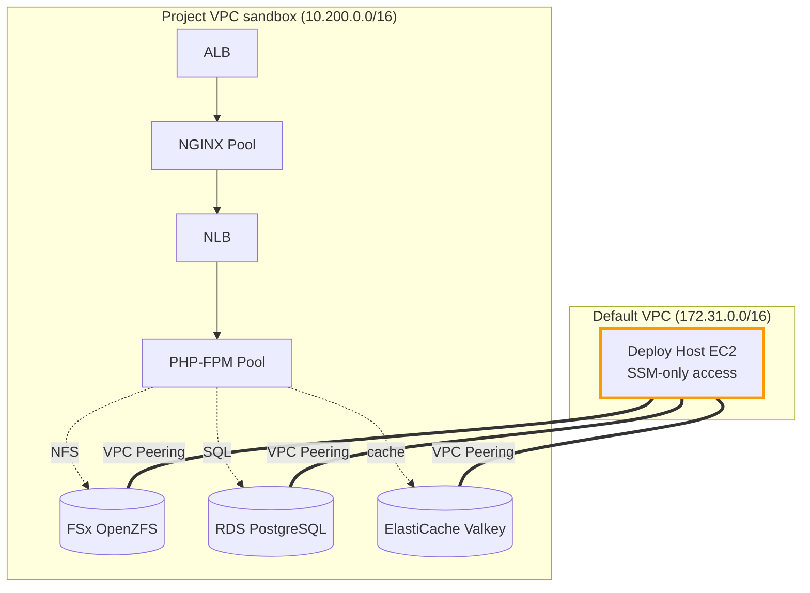
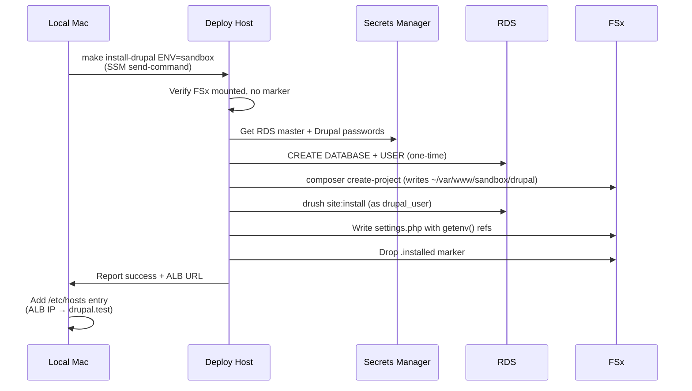

# Drupal Install Plan

**Status**: Planning — not implemented
**Author**: Kurt Vanderwater
**Created**: 2026-05-06
**Target Implementation**: TBD

## Purpose

Provide a working Drupal 11 environment that exercises the full
`cf-scalable-drupal` infrastructure stack end-to-end. The goal is a sample
application that proves:

- FSx OpenZFS shared storage works (PHP code lives there)
- RDS PostgreSQL Multi-AZ works (Drupal database)
- ElastiCache Valkey works (sessions + cache backend)
- ALB → NGINX → NLB → PHP-FPM request path works
- Boot script flow correctly wires PHP-FPM to all backends
- Auto-scaling 7-day instance lifecycle survives Drupal workloads

This is a **test/development tool**, not production hosting infrastructure.

## Scope

| In Scope | Out of Scope |
|----------|--------------|
| Drupal 11 install via Drush | WordPress (PostgreSQL incompatibility) |
| Per-environment parameterization | Multi-tenant Drupal (one site per env) |
| /etc/hosts-based hostname mapping | Real DNS / Route 53 records |
| Full install/remove/reinstall lifecycle | Backup/restore of installed sites |
| Drush operations from deploy-host | Drush on serving instances |

## Decisions Captured

| # | Topic | Decision |
|---|-------|----------|
| 1 | Drupal version | Drupal 11 |
| 2 | WordPress support | **Skip** — PostgreSQL incompatibility |
| 3 | Hostname strategy | Direct ALB DNS via local `/etc/hosts`; parameterize the site name (default `drupal.test`) |
| 4 | Database creation | `make install-drupal` uses RDS master credentials briefly to create DB + restricted user; Drush runs as the restricted user |
| 5 | Re-run behavior | Errors out if `.installed` marker exists; `make remove-drupal` and `make reinstall-drupal` provide controlled re-creation |
| 6 | Per-environment | Yes — every artifact parameterized by `EnvironmentName` |
| 7 | Tear-down | Full — drops Drupal database AND wipes `/var/www/drupal` from FSx |
| 8 | Drush location | Deploy-host only; never on serving instances |
| 9 | Installer location | Deploy-host (with VPC peering); not a one-shot EC2 |
| 10 | Settings.php | Dynamic via `getenv()`; PHP-FPM pool config exposes env vars set by boot script (matches existing Valkey pattern) |
| 11 | Make target context | Install/remove targets work from local Mac (via SSM send-command) or directly on deploy-host (runs script locally) |
| 12 | Auto-start deploy-host | **No** — fail with clear message if deploy-host is stopped (avoid surprise costs) |
| 13 | Drush invocation | **Run drush directly on deploy-host** — no make wrapper. Drush has too many variations to wrap cleanly. Standard workflow: SSM into deploy-host, `cd /var/www/${env}/drupal`, run `drush <whatever>`. |

## Three-Phase Plan

The Drupal install can't happen until the deploy-host can reach the project
VPC's internal services. So we have two prerequisite phases before the Drupal
work itself.

### Phase A — VPC Peering (Prerequisite)

**Goal**: Connect the deploy-host's default VPC (`172.31.0.0/16`) to each
project VPC (sandbox `10.200.0.0/16`, staging `10.102.0.0/16`, production
`10.101.0.0/16`) so the deploy-host can reach FSx, RDS, and Valkey.

**No CIDR collisions** — confirmed safe to peer.

#### Stack Ordering

Both VPCs must exist before peering can be created. The deploy-host VPC is the
AWS default VPC (always exists). The project VPC is created per-environment.
Therefore peering is **per-environment**, deployed after the project VPC exists.

```
cf-deploy-host.yaml          (one global instance — deploy-host EC2 in default VPC)
cf-vpc.yaml                  (per-environment — project VPC)
cf-deploy-peering.yaml  ←────  Bridges the two; per-environment
cf-iam.yaml
cf-storage.yaml
cf-database.yaml
cf-cache.yaml
... (rest of compute lifecycle)
```

#### `cf-deploy-peering.yaml` Resources

- **VPC Peering Connection** between default VPC and project VPC
- **Route table entries**:
  - Default VPC routes: `<project-cidr>` → peering connection
  - Project VPC routes (public + private route tables): `172.31.0.0/16` → peering connection
- **Security Group rule additions**:
  - FSx SG: allow NFS (2049) from deploy-host SG via peering
  - RDS SG: allow PostgreSQL (5432) from deploy-host SG
  - Valkey SG: allow 6379 from deploy-host SG
- **Output**: peering connection ID, confirmation that routes are in place

#### Make Target Integration

```makefile
deploy-peering:
    aws cloudformation deploy \
        --stack-name cf-scalable-web-$(ENV)-deploy-peering \
        --template-file cloudformation/cf-deploy-peering.yaml \
        --parameter-overrides EnvironmentName=$(ENV) ...

deploy-all: deploy-vpc deploy-peering deploy-iam deploy-storage ...
                          ↑─── new step
```

`make deploy-all` automatically includes peering. For environments without a
deploy-host yet, `deploy-peering` becomes optional / skipped.

#### Connectivity Validation

A new `make test-peering ENV=sandbox` target that SSM-execs onto deploy-host and:

- `ping <RDS_ENDPOINT>` (well, `nc -zv` since ICMP may be blocked)
- `nc -zv <RDS_ENDPOINT> 5432`
- `nc -zv <FSx_DNS> 2049`
- `nc -zv <Valkey_ENDPOINT> 6379`

Reports success/failure for each. This becomes part of CI/smoke tests.

### Phase B — Deploy-Host Toolchain Expansion

The deploy-host needs additional tools to act as a Drupal management workstation.

#### New Tools Installed

| Tool | Purpose | Install Command |
|------|---------|-----------------|
| `nfs-common` | Mount FSx OpenZFS at `/var/www` | `apt install nfs-common` |
| `postgresql-client-17` | `psql` for ad-hoc DB queries + master setup step | `apt install postgresql-client` |
| `valkey` | `valkey-cli` for cache ops | `apt install valkey-tools` (or build from source) |
| PHP 8.3 CLI + extensions | Required for Composer + Drush | `apt install php8.3-cli php8.3-pgsql php8.3-curl ...` |
| Composer | Install/update Drupal codebase | `curl -sS https://getcomposer.org/installer ...` |
| Drush launcher | `drush` command in PATH | `composer global require drush/drush` |
| `session-manager-plugin` | Better SSM CLI experience (already on TODO) | AWS-provided package |

These additions go into `cf-deploy-host.yaml` UserData OR a separate config-management script that the deploy-host runs at boot. UserData is simpler for now.

#### FSx Mount on Deploy-Host

Add to deploy-host UserData (after VPC peering exists):

```bash
# Mount project FSx — same path as PHP serving instances
mkdir -p /var/www
echo "$FSX_DNS:/fsx /var/www nfs4 vers=4.1,port=2049 0 0" >> /etc/fstab
mount -a
```

Multiple environments → multiple mount points? Possible designs:
- **Option A**: `/var/www/sandbox`, `/var/www/staging`, etc.
- **Option B**: Mount only the active environment, switchable via a script

For v1, Option A is simpler. Each env's FSx mounts to its own subdirectory.

The Drupal install path becomes `/var/www/<env>/drupal`.

#### Marker File

Deploy-host UserData writes `/etc/worxco/deploy-host-marker`. This is how
scripts and Make targets detect "I'm running on the deploy-host" vs "I need
to send via SSM."

### Phase C — Drupal Stack + Make Targets

#### `cf-app-drupal.yaml` (per environment)

A minimal CloudFormation stack that holds configuration but doesn't perform
the install. The install is triggered by `make install-drupal`.

**Parameters**:
- `EnvironmentName` (sandbox/staging/production)
- `DrupalVersion` (default: `11`)
- `DrupalSiteName` (default: `drupal.test`) — used in trusted_host_patterns
- `DrupalAdminEmail`
- `DrupalDatabaseName` (default: `drupal_${EnvironmentName}`)

**Resources**:
- `DrupalAdminSecret` (Secrets Manager) — admin password generated at create time
- `DrupalDbSecret` (Secrets Manager) — Drupal DB user password (separate from RDS master)
- SSM Parameters:
  - `/${env}/drupal/db-name`
  - `/${env}/drupal/db-user`
  - `/${env}/drupal/site-name`
  - `/${env}/drupal/site-path` (e.g., `/var/www/${env}/drupal`)

**Outputs**:
- `SiteURL` — the ALB DNS for this environment
- `EtcHostsLine` — ready-to-paste line for local `/etc/hosts`
- `InstallCommand` — e.g., `make install-drupal ENV=sandbox`

The stack itself is fast and cheap to deploy. The install work happens in
the Make target.

#### Install Script: `scripts/install-drupal.sh`

Designed to run on deploy-host. The Make target either invokes this directly
(if on deploy-host) or sends via SSM (if on Mac).

**Flow**:

1. **Validate environment** — `EnvironmentName` parameter required
2. **Verify FSx mounted** — fail if `/var/www/${ENV}` not mounted
3. **Check marker** — fail if `/var/www/${ENV}/drupal/.installed` exists
4. **Fetch credentials** from Secrets Manager:
   - RDS master password (one-time use)
   - Drupal admin password
   - Drupal DB user password
5. **Create database + restricted user** in RDS:
   ```sql
   CREATE DATABASE drupal_${env};
   CREATE USER drupal_user WITH PASSWORD '${drupal_db_pw}';
   GRANT ALL PRIVILEGES ON DATABASE drupal_${env} TO drupal_user;
   ```
6. **Composer create-project**:
   ```bash
   composer create-project drupal/recommended-project /var/www/${env}/drupal --no-interaction
   cd /var/www/${env}/drupal
   composer require drush/drush
   ```
7. **Drush site:install**:
   ```bash
   vendor/bin/drush site:install standard \
       --db-url="pgsql://drupal_user:${pw}@${rds}/drupal_${env}" \
       --account-name=admin \
       --account-pass="${admin_pw}" \
       --account-mail="${admin_email}" \
       --site-name="Drupal ${env}" \
       --yes
   ```
8. **Write `settings.php`** with `getenv()`-based config (see Settings.php Strategy below)
9. **Set permissions** — files dir writable, settings.php read-only
10. **Drop marker** — `touch /var/www/${env}/drupal/.installed`
11. **Report** — site URL, admin URL, /etc/hosts line

#### Remove Script: `scripts/remove-drupal.sh`

1. Drop database via psql (using master credentials)
2. Drop drupal_user
3. `rm -rf /var/www/${env}/drupal`
4. Remove marker (gone with the directory anyway)

#### Make Targets

Three Make targets cover the lifecycle. Drush operations are *not* wrapped —
they run directly on the deploy-host (see note below).

```makefile
install-drupal:
    @if [ -f /etc/worxco/deploy-host-marker ]; then \
        bash scripts/install-drupal.sh $(ENV); \
    else \
        $(MAKE) _verify-deploy-host-running; \
        aws ssm send-command --instance-ids $(DEPLOY_HOST_ID) \
            --document-name AWS-RunShellScript \
            --parameters "commands=['cd /home/ubuntu/cf-scalable-drupal && bash scripts/install-drupal.sh $(ENV)']" \
            --output text; \
    fi

remove-drupal:
    # Same pattern as install-drupal — local vs SSM dispatch

reinstall-drupal: remove-drupal install-drupal

# Note: No `make drush` wrapper. Drush has too many flag variations
# to wrap cleanly via Make. Run drush directly on the deploy-host:
#
#   $ aws ssm start-session --target $DEPLOY_HOST_ID
#   $ cd /var/www/sandbox/drupal
#   $ drush cr             # or any other drush command
#
# Drush is in PATH on the deploy-host (composer global install).

_verify-deploy-host-running:
    @STATE=$$(aws ec2 describe-instances --instance-ids $(DEPLOY_HOST_ID) \
        --query 'Reservations[0].Instances[0].State.Name' --output text); \
    if [ "$$STATE" != "running" ]; then \
        echo "Deploy-host is $$STATE. Run: make start-deploy-host"; \
        exit 1; \
    fi
```

## Settings.php Strategy

### Pattern: Dynamic via Env Vars

Drupal `settings.php` reads connection info from environment variables, not
hardcoded values. PHP-FPM passes the env vars through to PHP processes.

**`settings.php` excerpt** (generated by install script):

```php
$databases['default']['default'] = [
  'driver' => 'pgsql',
  'host' => getenv('DRUPAL_DB_HOST'),
  'database' => getenv('DRUPAL_DB_NAME'),
  'username' => getenv('DRUPAL_DB_USER'),
  'password' => getenv('DRUPAL_DB_PASS'),
  'port' => getenv('DRUPAL_DB_PORT') ?: '5432',
];

$settings['cache']['default'] = 'cache.backend.valkey';
$settings['valkey.connection']['interface'] = 'PhpRedis';
$settings['valkey.connection']['host'] = getenv('VALKEY_HOST');
$settings['valkey.connection']['port'] = getenv('VALKEY_PORT') ?: '6379';
$settings['valkey.connection']['password'] = getenv('VALKEY_AUTH_TOKEN');

// trusted_host_patterns: permissive for sandbox/staging (any ALB DNS),
// but production should be tightened to the specific ALB DNS only
// for audit compliance. The install script writes the appropriate
// patterns based on EnvironmentName.
$settings['trusted_host_patterns'] = [
  '^' . preg_quote(getenv('DRUPAL_SITE_NAME')) . '$',
  // sandbox/staging only: '^.+\.elb\.amazonaws\.com$'
  // production: '^' . preg_quote(getenv('DRUPAL_ALB_DNS')) . '$'
];

$settings['file_public_path'] = 'sites/default/files';
$settings['file_private_path'] = '/var/www/' . getenv('ENVIRONMENT_NAME') . '/drupal-private';
```

### Boot Script Integration

Extend `/opt/worxco/configure-php.sh` (already on PHP AMIs) to set Drupal env
vars in the PHP-FPM pool config:

```bash
# Existing: Valkey config
VALKEY_HOST=$(aws ssm get-parameter --name /${env}/cache/endpoint --query 'Parameter.Value' --output text)

# New: Drupal config (only if Drupal is installed for this env)
if aws ssm get-parameter --name /${env}/drupal/db-name 2>/dev/null; then
  DB_HOST=$(aws ssm get-parameter --name /${env}/rds/endpoint --query 'Parameter.Value' --output text)
  DB_NAME=$(aws ssm get-parameter --name /${env}/drupal/db-name --query 'Parameter.Value' --output text)
  DB_USER=$(aws ssm get-parameter --name /${env}/drupal/db-user --query 'Parameter.Value' --output text)
  DB_PASS=$(aws secretsmanager get-secret-value --secret-id worxco/${env}/drupal/db-secret --query SecretString --output text)
  SITE_NAME=$(aws ssm get-parameter --name /${env}/drupal/site-name --query 'Parameter.Value' --output text)

  cat >> /etc/php-fpm.d/drupal.conf <<EOF
env[ENVIRONMENT_NAME] = ${env}
env[DRUPAL_DB_HOST] = ${DB_HOST}
env[DRUPAL_DB_NAME] = ${DB_NAME}
env[DRUPAL_DB_USER] = ${DB_USER}
env[DRUPAL_DB_PASS] = ${DB_PASS}
env[DRUPAL_SITE_NAME] = ${SITE_NAME}
env[VALKEY_HOST] = ${VALKEY_HOST}
env[VALKEY_AUTH_TOKEN] = ${VALKEY_AUTH}
EOF

  systemctl restart php8.3-fpm
fi
```

This pattern means:
- New PHP instances coming up via auto-scaling get the right env vars automatically
- Endpoint changes (RDS failover, etc.) are picked up on next boot/restart
- No `settings.php` edits needed when infrastructure changes

## Architecture Diagrams

### Network Topology with Peering



### Install Flow



## Open Questions / Future Decisions

1. **Multiple Drupal versions per environment?**
   v1 supports one Drupal install per environment. Future: support multiple
   installs per env (e.g., D11 at `/drupal11`, D10 at `/drupal10` for
   compatibility testing)?

2. **Module/theme staging?**
   How does a developer test a new module before it goes to production?
   Probably: install in sandbox env, validate, promote via Composer in staging.

3. **Database migrations between environments?**
   `drush sql:dump` from one env, restore to another? Out of scope for v1
   but worth thinking about.

4. **Auto-start deploy-host?**
   Currently: fail if deploy-host is stopped. Could revisit if it becomes
   annoying in practice.

5. **WordPress later?**
   If WordPress is ever revived, options include:
   - Add a parallel MySQL RDS instance (`cf-database-mysql.yaml`)
   - Use the postgres-for-wordpress plugin (compatibility headaches)
   - Skip permanently

## Implementation Sequencing

When ready to implement, suggested order:

1. **Phase A.1**: Build `cf-deploy-peering.yaml` for sandbox; deploy and validate
2. **Phase A.2**: Add `make deploy-peering` and `make test-peering` targets
3. **Phase A.3**: Add `deploy-peering` to `make deploy-all` lifecycle
4. **Phase B.1**: Add tooling (composer, drush, psql, etc.) to deploy-host UserData
5. **Phase B.2**: Add FSx mount to deploy-host UserData (per-env subdirectory)
6. **Phase B.3**: Test that deploy-host can read/write FSx, query RDS, ping Valkey
7. **Phase C.1**: Build `cf-app-drupal.yaml` minimal stack (Secrets, SSM params)
8. **Phase C.2**: Write `scripts/install-drupal.sh` and `scripts/remove-drupal.sh`
9. **Phase C.3**: Add Make targets (install-drupal, remove-drupal, reinstall-drupal, drush)
10. **Phase C.4**: Update PHP-FPM boot script to set Drupal env vars
11. **Phase C.5**: Trigger full install on sandbox; validate site loads
12. **Phase C.6**: Document in `docs/DRUPAL.md` (user-facing operational guide)
13. **Phase C.7**: Repeat C.5 for staging/production environments

## Validation Criteria

A working v1 means:

- [ ] `make deploy-all ENV=sandbox` includes peering automatically
- [ ] Deploy-host can `nc -zv` to FSx, RDS, Valkey
- [ ] `make install-drupal ENV=sandbox` from local Mac succeeds
- [ ] Loading the ALB DNS in a browser shows Drupal welcome page
- [ ] Adding `<ALB-IP> drupal.test` to `/etc/hosts` and visiting `http://drupal.test` works
- [ ] Logging in as admin works
- [ ] PHP instances cycling (auto-scaling lifecycle) doesn't break the site
- [ ] `make remove-drupal ENV=sandbox` cleanly removes everything
- [ ] `make reinstall-drupal ENV=sandbox` starts from clean state

## Related TODOs

These existing TODO.md items become part of this work:

- [ ] [cf-scalable-drupal] VPC peering: deploy host to project VPC
- [ ] [cf-scalable-drupal] Install session-manager-plugin on deploy host
- [ ] [cf-scalable-drupal] Install database and cache CLI tools on deploy host
- [ ] [general] Get educated on Secrets Manager rotation (cost, mechanics, *why* to use it, when to enable)

---

<sub>**License:** GPL-2.0-or-later | **Copyright:** © 2026 The Worx Company | **Author:** Kurt Vanderwater <<kurt@worxco.net>></sub>
