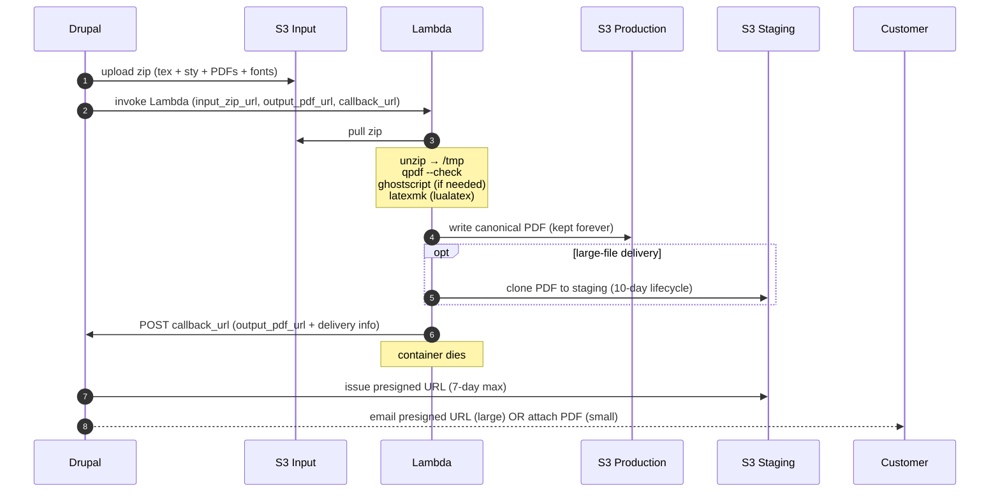
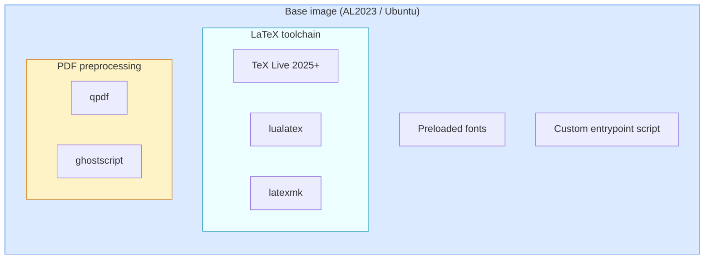
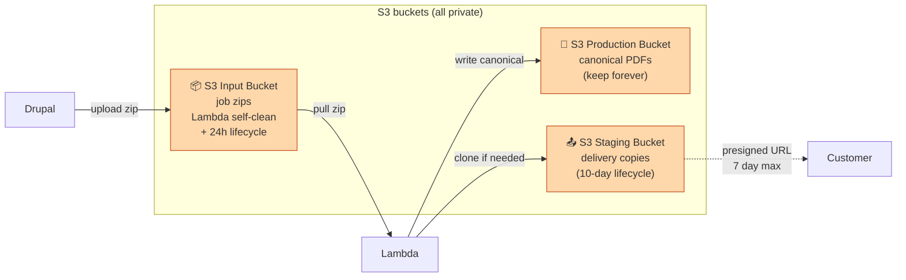
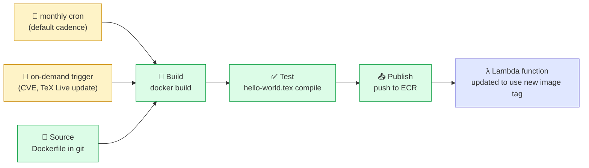

# LaTeX-on-Lambda — Meeting Outcomes (2026-08-13)

> **Companion to** [`latex-on-lambda-2026-08-13.tex`](./latex-on-lambda-2026-08-13.tex) / [`.pdf`](./latex-on-lambda-2026-08-13.pdf).
> The full PDF has the pre-meeting options landscape (chapters 1–8) plus per-option
> technical appendices. This Markdown summarizes only the **decisions and design
> choices confirmed in the 2026-08-13 meeting** — for Obsidian and IDE navigation.
>
> Both documents carry the same meeting content; diagrams here use Mermaid
> (native in Obsidian and GitHub) so they render inline in the tools you use daily.

## Attendees and Context

Four attendees:

- **Zac Hudson** — client Drupal developer; owner of the existing Docker-based LaTeX generation code; author of the current `Document Service latex Generator`
- **Kurt Vanderwater** — WorxCo operations/infrastructure; owner of the scalable AWS architecture
- **Pat Shaughnessy** — author of the original 2024 Lambda LaTeX MVP; observer plus institutional reference
- **Tim Houseman** — observer / team member

Meeting was one hour; approximately half was Lambda-focused technical discussion; the rest covered adjacent operational topics (Postgres, multi-tenancy roadmap, order/pricing walkthrough) not summarized here.

---

## Decisions Confirmed

### 1. Execution model: Lambda

Lambda selected. App Runner ruled out (roughly **2× the cost** with no compelling
advantage). Fargate, Batch, and dedicated EC2 ASG deferred without further
consideration — Lambda's scale-to-zero, pay-per-invocation, and image-based
deployment shape fit the workload and existing operational patterns.

### 2. Container: fresh build, not from MVP

Pat's 2024 MVP is architectural inspiration only. Too much has changed
(TeX Live version, Lambda container-image support maturity, `latexmk` auto-iteration)
to make direct code reuse worthwhile. The new container is a clean build.

### 3. Container lifecycle: Image Builder pipeline

The Lambda container image will be built and refreshed via an **ECR-container
Image Builder pipeline**, symmetric with the existing nginx/php83 AMI pipelines.

- **Default cadence: monthly rebuild** on the current base image with fresh package versions
- **On-demand trigger** available for CVE response, new TeX Live releases, or template dependency changes
- Ghostscript's CVE history alone justifies the automated refresh

### 4. Delivery: staging-bucket clone with lifecycle

The finished PDF is written to **two locations**:

- **Production S3 bucket** — keeps the PDF **forever** as the canonical record
- **Staging S3 bucket** (only when large-file delivery via presigned URL is needed) — object auto-expires after **10 days**; presigned URL valid for **max 7 days** (always shorter than the object's remaining lifetime)

Compared to presigning against the production bucket directly, this pattern gives:

- Smaller blast radius on a leaked URL (points at a file that's going away anyway)
- Auditable "what is currently externally accessible" view (the staging bucket **is** the list)
- Ability to revoke access surgically (delete the staging object) without rotating keys
- Clean compliance story: no production data leaves the private bucket

---

## Payload Contract

**Three required parameters** on every Lambda invocation. All required — Zac's phrasing:

> *"if you don't tell me how to notify you when I'm done, I don't want to talk to you at all."*

| Parameter | Purpose |
|---|---|
| `input_zip_url` | S3 URL of the input zip that Drupal has built and uploaded. Contains everything the Lambda needs to compile: main `.tex` file, `.sty` style files, all PDFs to be included, plus any per-report font files not already baked into the container. |
| `output_pdf_url` | S3 URL where the finished PDF should be written. Drupal decides the exact path (including any date prefix, tenant prefix, etc.) so name collisions are Drupal's problem, not Lambda's. Also becomes the "handle" by which Drupal tracks the job. |
| `callback_url` | HTTP endpoint Drupal exposes to receive the "done" notification when Lambda finishes. Different Drupal modules (report, invoice, future residential) may register different endpoints. |

The callback message contains at minimum the same `output_pdf_url` value that
Drupal supplied on invocation — self-contained, so Drupal tracks correlation
by destination filename with no separate correlation ID needed.

---

## End-to-End Flow



---

## Lambda Container Contents



**Invocation contract**: 3 required params (`input_zip_url`, `output_pdf_url`, `callback_url`).

TeX Live provides `lualatex` + `latexmk`. QPDF and Ghostscript preprocess incoming PDFs.
Fonts and the entrypoint script complete the image.

---

## Storage Architecture



**Three-bucket model** — input bucket holds job payloads, production bucket keeps the
canonical PDF forever, staging bucket receives a copy only when large-file delivery via
presigned URL is required. Objects auto-expire after 10 days, presigned URLs valid for
max 7 days — URL always expires before the underlying object.

---

## Image Builder Pipeline



**ECR-container Image Builder pipeline** for the Lambda LaTeX image. Monthly cadence
by default; on-demand trigger for CVE response or toolchain updates. Symmetric with
existing nginx/php83 AMI pipelines — reuses operational patterns.

---

## Applies-to Breadth

The Lambda infrastructure is **not report-specific**. Same pipeline serves multiple
document types, each potentially with its own callback endpoint:

- **Conformance reports** (the original driver; commercial today)
- **Invoices** (already LaTeX-generated in Zac's current Docker path)
- **Future: residential-market documents** (same code base, new Drupal module)

Each caller supplies its own `callback_url` at invocation time, so a single Lambda
function serves all three with per-module completion routing.

---

## Action Items

### Zac's TODO

- [ ] Send Kurt the path to the current `Document Service latex Generator` implementation (Docker-based)
- [ ] Send Kurt the current Drupal invocation points (where the code today calls into the Docker LaTeX pipeline) — Kurt uses this to build the patches that Drupal will need to redirect calls at Lambda
- [ ] Design the callback endpoint schema (payload shape, HTTP verbs, error semantics)
- [ ] Design the Drupal-side submission flow: build zip, upload to S3 input bucket, invoke Lambda with three params
- [ ] Add outstanding-jobs tracking to Drupal (a small table; up to ~1000 rows expected under residential load)
- [ ] Start work **next week** (2026-08-18 or later)

### WorxCo's TODO

- [ ] Build the Lambda container image (fresh, not from MVP): TeX Live 2025+, `lualatex`, `latexmk`, QPDF, Ghostscript, preloaded fonts, entrypoint script
- [ ] Build the ECR-container Image Builder pipeline with monthly + on-demand triggers
- [ ] Provision the three S3 buckets: input, production PDFs, staging (with 10-day lifecycle rule)
- [ ] Build the Lambda function + invocation-URL infrastructure that accepts the three-parameter call
- [ ] Provide Zac the Lambda invocation spec (HTTP endpoint URL, expected parameters, callback contract)
- [ ] Provide Zac the S3 write credentials/roles for the input bucket

---

## Drupal-Side Configuration

Configuration Zac needs to consume lives under a single namespaced key in
Drupal's `$settings[]` array. Baseline values live in the committed
`sites/default/settings.php`; per-environment overrides live in the git-ignored
`sites/default/settings.local.php` (Drupal's standard local-override pattern).

### Baseline — committed to git

Add to `sites/default/settings.php`:

```php
// Scalable-Web LaTeX/Lambda integration config.
// Environment-specific overrides go in settings.local.php.
$settings['scalable_web']['lambda_latex'] = [
  'input_bucket'         => 'sandbox-latex-input',
  'production_bucket'    => 'sandbox-latex-production',
  'staging_bucket'       => 'sandbox-latex-staging',
  'max_inline_bytes'     => 5 * 1024 * 1024,   // 5 MB email-attach ceiling
  'presigned_url_ttl'    => 7 * 86400,         // 7 days max (S3 hard limit)
  'lambda_invoke_url'    => 'https://<api-id>.execute-api.us-east-1.amazonaws.com/prod/latex',
  'lambda_region'        => 'us-east-1',
];

// Enable per-env override loading (usually already present, commented).
if (file_exists($app_root . '/' . $site_path . '/settings.local.php')) {
  include $app_root . '/' . $site_path . '/settings.local.php';
}
```

### Per-env overrides — NOT committed

In `sites/default/settings.local.php` (each dev has their own; not in git):

```php
// Point at your personal sandbox buckets + Lambda endpoint.
$settings['scalable_web']['lambda_latex']['input_bucket']      = 'zac-dev-latex-input';
$settings['scalable_web']['lambda_latex']['production_bucket'] = 'zac-dev-latex-production';
$settings['scalable_web']['lambda_latex']['staging_bucket']    = 'zac-dev-latex-staging';
$settings['scalable_web']['lambda_latex']['lambda_invoke_url'] = 'https://<dev-api-id>.execute-api.us-east-1.amazonaws.com/dev/latex';
```

### Reading the config from Drupal code

```php
use Drupal\Core\Site\Settings;

$cfg = Settings::get('scalable_web')['lambda_latex'];
$inputBucket = $cfg['input_bucket'];
$maxInline   = $cfg['max_inline_bytes'];
```

### Why `$settings[]` and not `$config[]`

Drupal's two config surfaces:

- **`$settings[]`** — infrastructure/environment config, not exposed via admin UI. Examples in Drupal core: Redis config, memcached hosts, hash salt path. **This is where our AWS resource names live.**
- **`$config[]`** — runtime overrides for Drupal-entity config exported via CMI. Not the right fit for infra endpoints.

Nested-array style (`$settings['scalable_web']['lambda_latex']['input_bucket']`) is idiomatic Drupal for grouped settings.

---

## Presigned URL Generation

### Direct AWS SDK, not an intermediate Lambda

Presigned URL generation is a **local math operation** — the SDK computes
HMAC-SHA256 of the URL fields using the caller's IAM credentials. No AWS API
call is made. Round-tripping to Lambda just to get a signature would be
wasteful.

Drupal almost certainly already loads `aws/aws-sdk-php` via Composer (used by
`s3fs`/`flysystem_s3` for media). If not, one-line install:

```bash
composer require aws/aws-sdk-php
```

### The snippet

Drop-in for wherever Drupal decides to hand the customer a link:

```php
use Aws\S3\S3Client;
use Drupal\Core\Site\Settings;

$cfg = Settings::get('scalable_web')['lambda_latex'];

$s3 = new S3Client([
  'version' => 'latest',
  'region'  => $cfg['lambda_region'],
  // Credentials auto-resolved from IAM instance role attached to
  // the PHP-FPM instances. No static keys needed.
]);

$cmd = $s3->getCommand('GetObject', [
  'Bucket' => $cfg['staging_bucket'],
  'Key'    => $stagingKey,   // e.g. "reports/2026/08/report-12345.pdf"
]);

$request = $s3->createPresignedRequest($cmd, '+7 days');
$presignedUrl = (string) $request->getUri();

// $presignedUrl is what goes in the email body.
```

`createPresignedRequest` returns synchronously; no network call fires. The URL
is deterministic given (bucket, key, expiry, IAM key material).

### IAM permission Drupal's PHP-FPM role needs

Add to the PHP-FPM instance role's inline policy:

```json
{
  "Version": "2012-10-17",
  "Statement": [{
    "Effect": "Allow",
    "Action": "s3:GetObject",
    "Resource": "arn:aws:s3:::sandbox-latex-staging/*"
  }]
}
```

`GetObject` is sufficient for both actually reading objects AND generating
presigned URLs for GetObject. If Drupal also needs to write to the input bucket,
add `s3:PutObject` on the input bucket ARN separately.

### Why not store the URL somewhere and reuse it

Presigned URLs are cheap to generate (microseconds). Regenerate per request
rather than cache. Regeneration also gives you fresh 7-day windows every time —
caching would freeze the expiry at the first-generation moment.

---

## Input Bucket Lifecycle

Confirmed: input bucket is a **separate** bucket from production and staging.
Rationale (from the meeting discussion): blast-radius isolation — an accidental
`aws s3 rm --recursive` on the transient bucket cannot touch canonical PDFs.

### Cleanup: two-layer defense

1. **Primary: Lambda self-cleanup.** On successful compilation, Lambda deletes
   its own input zip from the input bucket before exiting. Typical lifetime of
   a payload: seconds to minutes, matching the Lambda run duration.
2. **Backup: S3 lifecycle rule for orphans.** If Lambda crashes or throttles
   before the cleanup step, the payload lingers. A lifecycle rule catches it.

### The lifecycle rule

```json
{
  "Rules": [{
    "ID": "expire-orphan-payloads",
    "Status": "Enabled",
    "Filter": {},
    "Expiration": { "Days": 1 }
  }]
}
```

### How S3 lifecycle actually behaves (worth understanding)

Concern that came up in review — "what if an object is created at 12:58 AM and
S3 scans at 1:00 AM?" Reassuring answer:

- **Lifecycle rules use OBJECT AGE, not calendar-day boundaries.**
  `ExpirationInDays: 1` means "eligible for deletion when object age ≥ 24
  hours," measured from the object's creation timestamp.
- **Guaranteed minimum lifetime**: 24 hours.
- **Typical lifetime**: 24–36 hours (depends on when S3's daily lifecycle scan
  runs relative to eligibility).
- **Worst-case lifetime**: ~48 hours (if scan just ran before eligibility crossed).
- An object created at 12:58 AM is safe from deletion until at least 12:58 AM
  the following day.

### If we ever need sub-day cleanup

S3 lifecycle can't do sub-day granularity. If we ever need it (unlikely for
this workload), the pattern is: EventBridge scheduled rule (hourly cron) →
cleanup Lambda that lists + deletes based on custom age criteria. Not building
this now; Lambda self-cleanup + 24h lifecycle backup is sufficient.

---

## Notes and Clarifications from the Meeting

- **LaTeX has no stream-wrapper support** — files must be local on disk. This is why
  the zip payload pattern is necessary; Lambda unzips into `/tmp` before running `latexmk`.
- **Toolchain is `lualatex` specifically**, not `pdflatex` or `xelatex`. Some included prod PDFs
  have quirks that only `lualatex` handles cleanly.
- **PDF preprocessing is two-stage**: `qpdf --check` on every input PDF; if it flags issues,
  run Ghostscript to normalize the PDF (strips extra content, may bump version). QPDF is
  fast at checking; Ghostscript is thorough at rewriting.
- **Fonts baked into the base container** for the shared set. Per-report font overrides
  can travel in the zip if needed.
- **Cost expectation (current-reality math)**: **current commercial volume is 200–500 reports/month** — not the aspirational 20K/month residential projection. Using an average of **250 reports/month at ~250 pages each** (Zac's reports run heavy), Lambda compute cost lands at roughly **$1–3/month** for actual invocations, plus a few dollars/month for Image Builder + ECR storage + S3 buckets. **Total realistic monthly bill for current-state operations: ~$5–10/month.** The 20K/month figures in the PDF's chapter 7 cost table remain valid **capacity projections** for the residential pivot when/if it materializes, not a current billing forecast. Also worth noting: at 250/mo (roughly 8/day), **every invocation is essentially a cold start** — 5–10 seconds of latency added to each report generation for the container spin-up. Not a problem for the async fire-and-callback flow, but a latency floor to be aware of.
- **Migration status of Docker in production**: the Docker LaTeX container was *not* migrated
  as part of the recent sandbox rebuild — production still runs the old Docker path. Zac
  needs to identify all the Drupal call sites so Kurt can prepare the patches that redirect
  them at Lambda.

---

## Cross-References

- Full pre-meeting options landscape + per-option technical appendices: [`latex-on-lambda-2026-08-13.pdf`](./latex-on-lambda-2026-08-13.pdf) (chapters 1–8 and appendices A–G)
- LaTeX source for the PDF: [`latex-on-lambda-2026-08-13.tex`](./latex-on-lambda-2026-08-13.tex) — chapter 9 mirrors this Markdown
- Related planning notes (pre-meeting):
  - [`docs/memory/pdf-generation-lambda-candidates.md`](../memory/pdf-generation-lambda-candidates.md)
  - [`docs/memory/phase-d-backlog.md`](../memory/phase-d-backlog.md)
  - [`docs/memory/research-document-bundle-gaps.md`](../memory/research-document-bundle-gaps.md)
- Meeting transcript (source): [`docs/Transcripts/2026-08-13 Meeting with Zac RE: LaTeX on Lambda for Zoning`](../Transcripts/)
